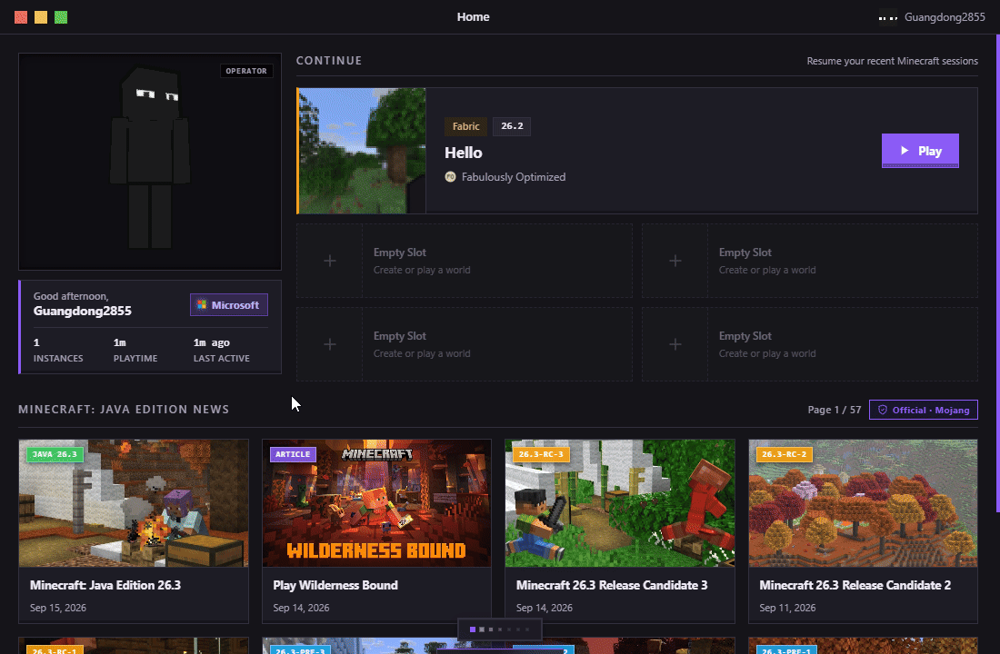
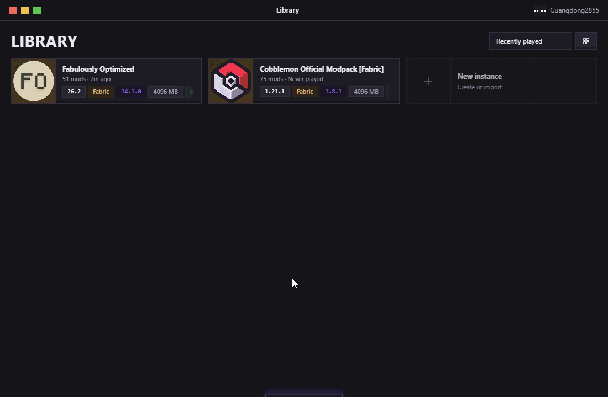
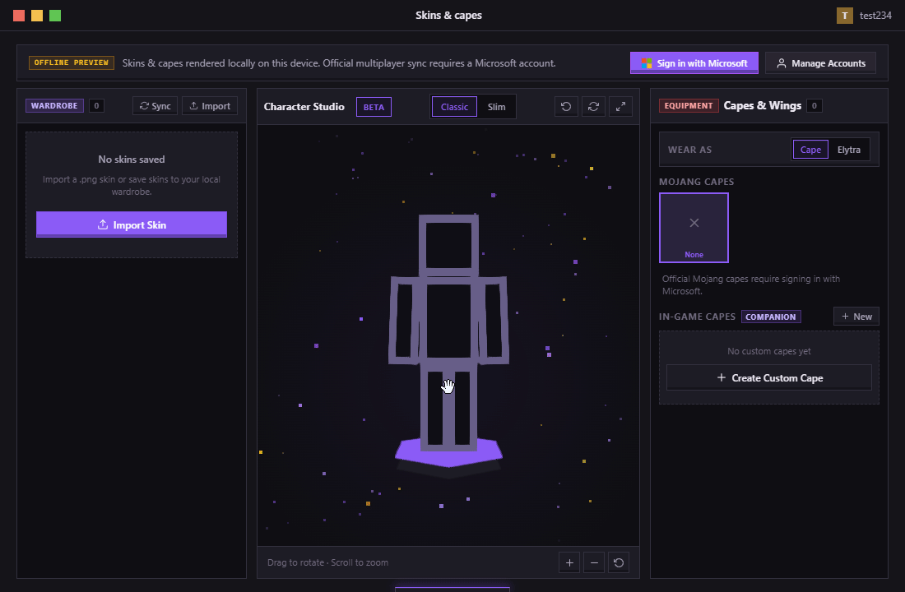
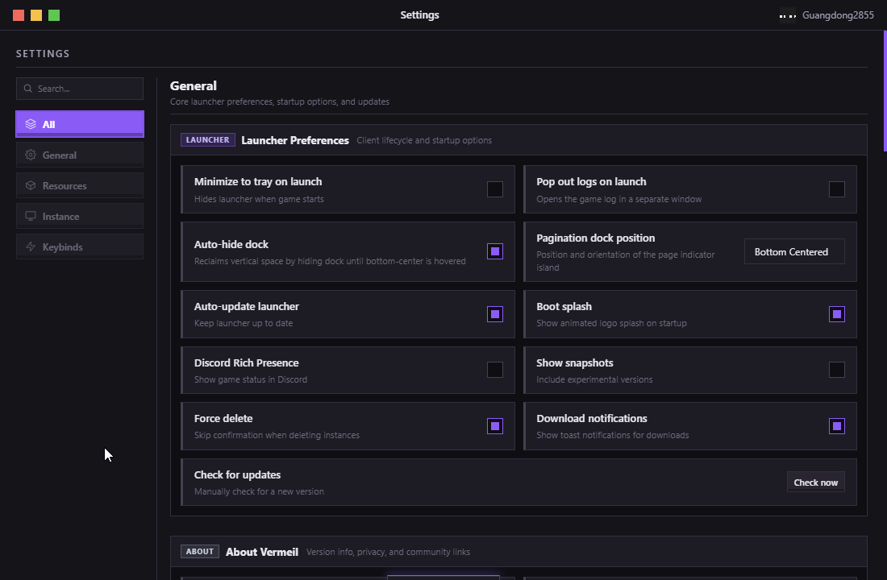
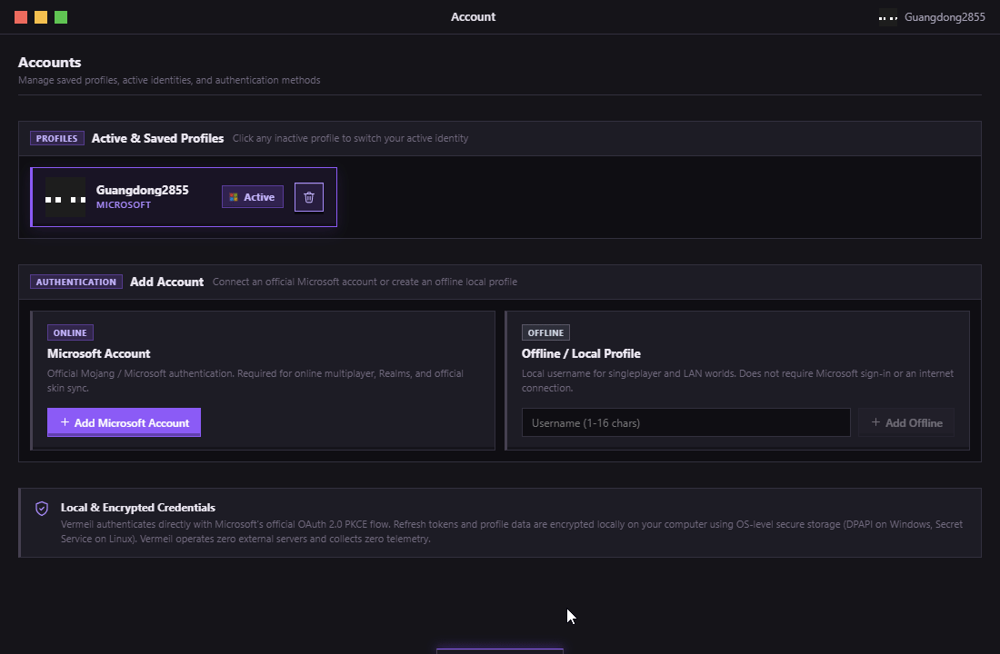

<p align="center">
  
</p>

<h1 align="center">Vermeil</h1>

<p align="center">
  <strong>A full-featured, open-source Minecraft: Java Edition launcher for Windows and Linux.</strong><br/>
  Microsoft sign-in, every major mod loader, modpack imports, managed Java, and zero telemetry.
</p>

<p align="center">
  <a href="https://github.com/Vermeil-Launcher/Vermeil-Launcher/releases/latest"></a>
  <a href="https://github.com/Vermeil-Launcher/Vermeil-Launcher/releases"></a>
  <a href="https://github.com/Vermeil-Launcher/Vermeil-Launcher/actions/workflows/ci.yml"></a>
  <a href="https://github.com/Vermeil-Launcher/Vermeil-Launcher/actions"></a>
  
  <a href="LICENSE"></a>
  
</p>

<p align="center">
  <a href="https://vermeillauncher.app/">Website</a> · <a href="https://github.com/Vermeil-Launcher/Vermeil-Launcher/releases/latest">Download</a> · <a href="https://github.com/Vermeil-Launcher/Vermeil-Launcher/issues">Issues</a>
</p>

---

> **Vermeil 1.x.** General availability stable release of Vermeil Launcher.
>
> **AI-generated codebase.** Built with AI assistance (Claude, Gemini, and GPT models). May contain bugs or incomplete features. See [DISCLAIMER.md](DISCLAIMER.md).
>
> **Not code-signed.** Some antivirus software may flag the installer. No funds for a signing certificate — use as-is or build from source.

## Table of Contents

- [Screenshots](#screenshots)
- [Features](#features)
- [Download](#download)
- [Development](#development)
- [Privacy](#privacy)
- [AI Disclosure](#ai-disclosure)
- [License](#license)

## Screenshots

> Animated previews from the official **v1.0.0** release.

<p align="center">
  
</p>
<p align="center">
  <em>Interactive 3D character stage, telemetry stats, Minecraft news, and recent worlds continue station</em>
</p>

<p align="center">
  
  
</p>
<p align="center">
  <em>Tactile instance management with floating dock, and the 3D Character Studio with skin history sync</em>
</p>

<p align="center">
  
  
</p>
<p align="center">
  <em>Tactile launcher preferences, storage management, and encrypted local account profiles</em>
</p>

<p align="center">
  <a href="docs/SCREENSHOTS.md"><strong>Explore the full animated gallery and screen details &rarr;</strong></a>
</p>

## Features

- Microsoft account authentication (multiple accounts + offline)
- Instance management with per-instance settings
- Mod loader support: Fabric, Quilt, NeoForge, Forge
- Mod browsing and installation from Modrinth and CurseForge — click any result card to open its details and pick a specific version, or hit Install to get the newest compatible one
- Modpack import (.mrpack and CurseForge zip)
- Automatic Java detection and download (Adoptium)
- Adaptive RAM allocation per instance
- Discord Rich Presence
- 3D skin viewer with upload, cape, and elytra support
- Skin Wardrobe with on-demand historical skin synchronization from Crafty.gg
- Companion mod for in-game custom capes
- Auto-updater (Windows and Linux AppImage)
- Global video settings (FPS, VSync, FOV, GUI Scale, FOV Effects)
- Download history
- Zero telemetry

## Download

Get the latest release from the [Releases page](https://github.com/Davekb1976/Vermeil-Launcher/releases/latest).

### Windows

Download and run the `.exe` installer. Per-user install, no admin required. Uninstall from Settings > Apps.

### Linux (one-liner)

```bash
curl -fsSL https://raw.githubusercontent.com/Davekb1976/Vermeil-Launcher/main/install.sh | bash
```

Downloads the AppImage to `~/.local/bin` and creates a desktop entry. Remove with `vermeil-uninstall`.

## Development

Built with [Tauri 2](https://tauri.app/) (Rust) and [SolidJS](https://www.solidjs.com/) (TypeScript).

See [docs/DEVELOPMENT.md](docs/DEVELOPMENT.md) for setup instructions and build commands.

## Privacy

No data is collected or sent anywhere. All credentials, settings, and game data stay on your machine. See [PRIVACY.md](PRIVACY.md).

## AI Disclosure

This project was built entirely with AI assistance. The author directed architecture and feature choices; AI generated the code.

**Models:**

- Claude Opus 5 / Claude Sonnet 5 — primary code generation and architecture
- Gemini 3.8 Flash / Claude Opus 4.6 (Thinking) — ongoing development, agentic workflows, and architecture
- GPT 5.6 (Terra / Luna) — miscellaneous tasks
- Earlier development used Claude Opus 4.6–4.8 and Sonnet 4.6

**IDEs & Platforms:** Kiro, Antigravity 2.0

See [DISCLAIMER.md](DISCLAIMER.md) for the full disclosure.

## License

Source code: [MIT License](LICENSE). Logo and icons: All Rights Reserved. See [LICENSES.md](LICENSES.md).

This repository is public for transparency. External contributions are not accepted. Bug reports and feature suggestions via [Issues](https://github.com/Davekb1976/Vermeil-Launcher/issues) are welcome.
