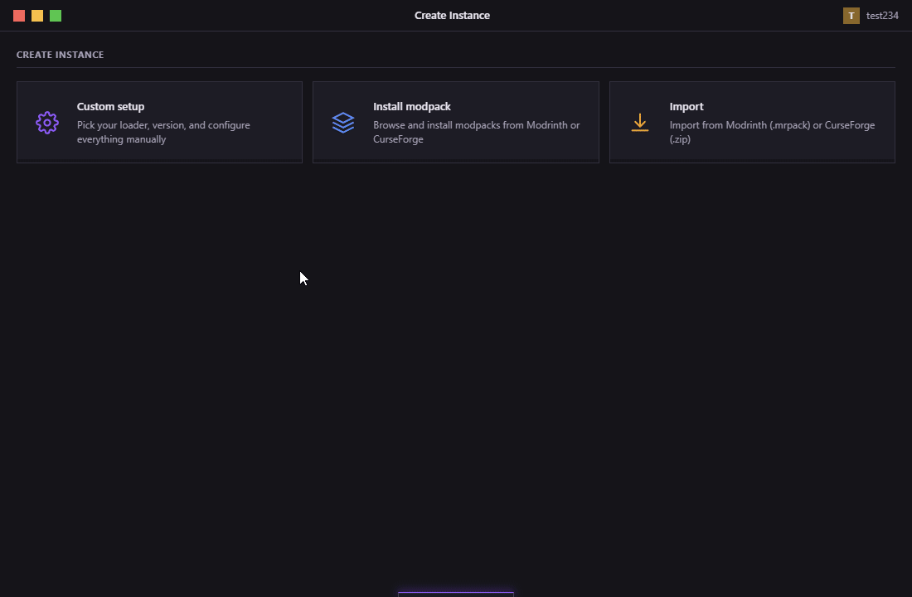
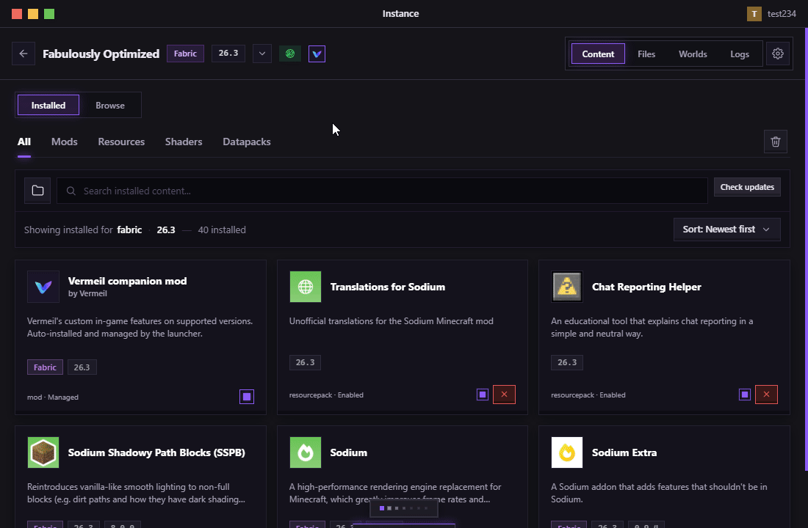
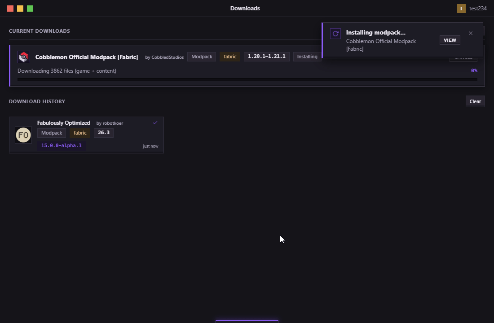

# Vermeil — Animated Gallery & UI Walkthrough (v1.0.0)

This gallery showcases the tactile UI design, 3D physics, and key screens in the official **v1.0.0** release.

---

## 1. Home Screen & Operator Hub

The command center for your Minecraft sessions. Features an interactive 3D character stage, tactical player telemetry, the latest official Minecraft news, and the Continue station for instant world resumption.

### Key Features Shown:
- **3D Character Stage**: WebGL-powered 3D player model with idle animations and gold `OPERATOR` tag.
- **Tactical Telemetry Base Plate**: One-click overview of active account status (Microsoft vs. Offline), total instance count, cumulative playtime, and relative last active timestamp.
- **Continue Where You Left Off**: Hero card featuring your most recently played singleplayer world with direct "Play" resume shortcut (supporting modern Minecraft 1.20+ Quick Play), plus a 2x2 sub-grid for previous worlds.
- **Minecraft News Station**: Up-to-date Java Edition news and release notes with categorized tactile badges (`Release`, `Snapshot`, `Pre-Release`, `RC`) and built-in full-text modal reader.

---

## 2. Instance Library

Browse, filter, and launch your Minecraft instances with chunky mechanical controls and fluid navigation.

### Key Features Shown:
- **Tactile Instance Cards**: SloppyKeys 3D beveled cards with distinct 3px left border accents, loader badges (`Fabric`, `Forge`, `NeoForge`, `Quilt`), and direct Play action buttons.
- **Floating Dock**: Centered bottom navigation dock with animated play button, multi-screen navigation pills, and pinned-instance quick switcher.
- **Search & Sort Tools**: Fast fuzzy searching, sort by recent play / alphabetical, and compact list vs. rich grid view toggles.

---

## 3. Create & Import Instance Wizard

Easily create custom instances or import modpacks from archives and online repositories.

### Key Features Shown:
- **Three Import Pathways**: Choose between **Custom Instance**, **Modpack Browser** (Modrinth / CurseForge), or **Local Archive Import** (`.mrpack`, `.zip`).
- **Loader Selection Tabs**: Radio cards for Vanilla, Fabric, Quilt, NeoForge, and Forge with automatic loader version discovery.
- **Tactile Controls**: High-contrast inputs, custom dropdown pickers, and memory allocation controls.

---

## 4. 3D Character Studio & Skin Wardrobe

Inspect, customize, and manage your Minecraft skins and capes in real time.

### Key Features Shown:
- **3D WebGL Studio**: Free-look orbital camera with voxel ember particle stage and animated elytra flutter preview.
- **Classic vs. Slim Toggle**: Instant switching between 4-pixel and 3-pixel arm models.
- **Skin Wardrobe**: Persistent local skin library capturing your active skins over time.
- **Crafty.gg Historical Sync**: One-click sync button retrieving your complete historical skin archives from Crafty.gg.
- **Custom Cape Designer**: Equip official Mojang capes or preview custom local capes for in-game rendering with Vermeil's companion mod.

---

## 5. Mod & Content Browser

Browse, search, and install mods, resource packs, shaders, and datapacks directly from **Modrinth** and **CurseForge** without leaving the launcher.

### Key Features Shown:
- **Unified Framed Control Panel**: Sunken search well, source switcher (Modrinth / CurseForge), bulk selection mode, and custom sort filter inside a cohesive framed box.
- **Category Filter Tabs**: One-click switching between *All*, *Mods*, *Resources*, *Shaders*, and *Datapacks*.
- **Tactile 3D Bevel Cards**: Mod cards featuring loader compatibility pills (`Fabric`, `Forge`, etc.), category tags, author names, description previews, and direct 3D install buttons.
- **Context Tabs**: Instant navigation between *Content*, *Files*, *Worlds*, *Logs*, and *Settings* for the active instance.

---

## 6. Launcher Settings & Performance Tuning

Configure launcher preferences, Java environments, JVM arguments, and download concurrency with tactile controls.

### Key Features Shown:
- **Categorized Sections**: Clean vertical navigation (*All*, *General*, *Resources*, *Instance Defaults*, *Keybinds*).
- **Tactile 3D Checkboxes**: High-contrast square mechanical-style toggle checkboxes with bevel depth.
- **Real-Time Download Rate Limiter**: Live token-bucket speed throttling slider to keep background downloads friendly with other network traffic.
- **Storage & Cache Controls**: Manage application data paths and purge cached downloads and metadata in one click.
- **Concurrency Limits**: Fine-tune simultaneous downloads and disk writes to match your bandwidth and hardware.

---

## 7. Account Management & Security

Seamlessly manage multiple Microsoft accounts and offline local profiles with zero telemetry.

### Key Features Shown:
- **Multi-Profile Support**: Easily switch between active Microsoft and offline/local player profiles.
- **Active Indicator & Avatar Previews**: Visual player head badges and active status indicators.
- **One-Click Microsoft OAuth 2.0 PKCE**: Official secure Microsoft sign-in without embedding third-party proxies.
- **Local & Encrypted Credentials**: Tokens and credentials are stored strictly on-device using OS-level secure storage (Windows DPAPI / Linux Secret Service). No external telemetry servers.

---

## 8. Download Manager & Active Installs

Track in-flight mod and modpack installations with live progress and complete cancellation control.

### Key Features Shown:
- **In-Flight Progress Cards**: Live percentage bar, transfer speed, file size counter, and loader badge.
- **One-Click Cancellation**: Safely abort running downloads at any time with immediate state cleanup.
- **Persistent History Log**: Permanent record of completed downloads with quick links to containing instances and external project pages.
