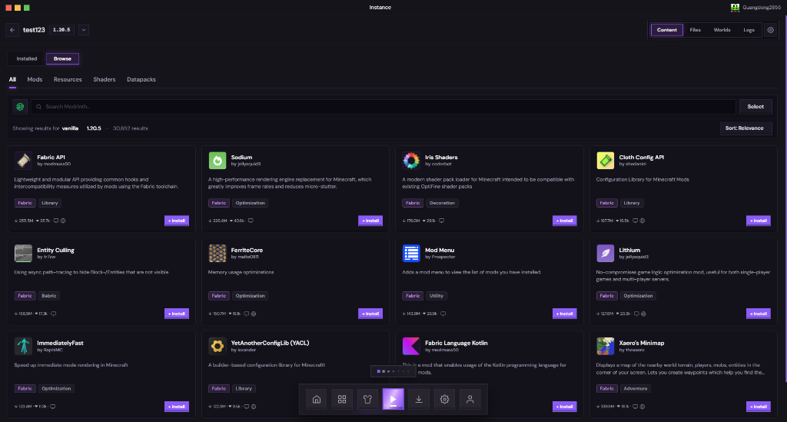
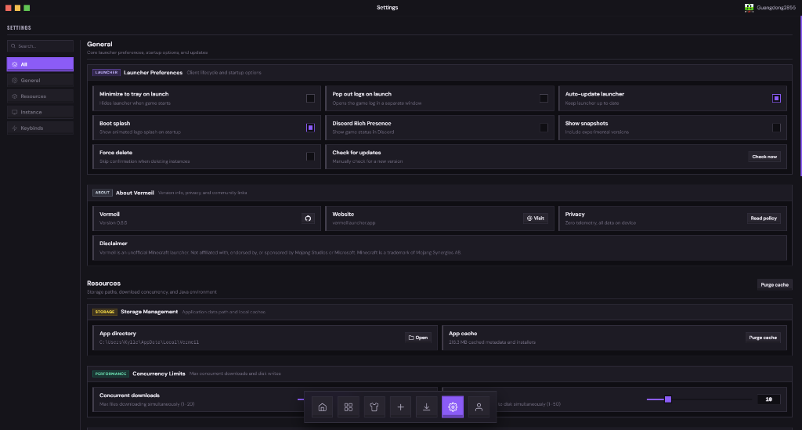
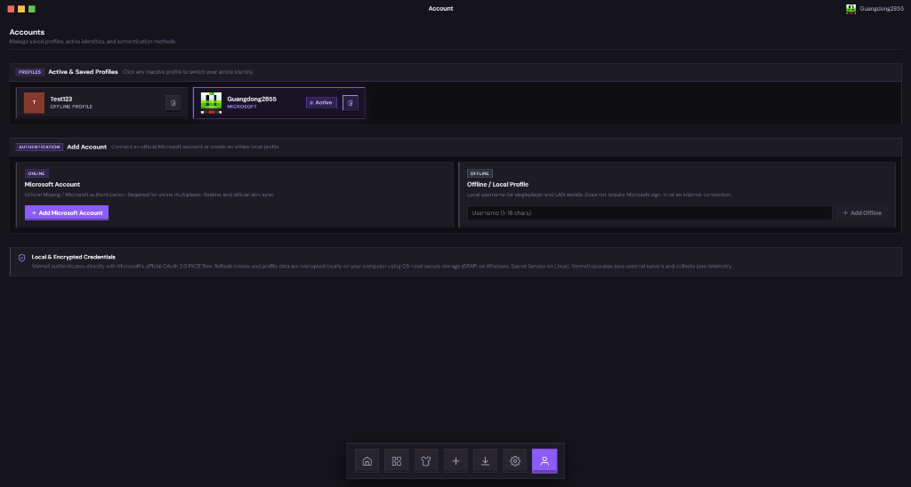

# Vermeil — Screenshot Gallery (v1.0.0)

This gallery showcases the tactile UI design and screens in the official **v1.0.0 release**.

---

## 1. Mod & Content Browser (Instance View)

Browse, search, and install mods, resource packs, shaders, and datapacks directly from **Modrinth** and **CurseForge** without leaving the launcher.

### Key Features Shown:
- **Unified Framed Control Panel**: Sunken search well, source switcher (Modrinth / CurseForge), bulk selection mode, and custom sort filter inside a cohesive framed box.
- **Category Filter Tabs**: One-click switching between *All*, *Mods*, *Resources*, *Shaders*, and *Datapacks*.
- **Tactile 3D Bevel Cards**: Mod cards featuring loader compatibility pills (`Fabric`, `Forge`, etc.), category tags, author names, description previews, and direct 3D install buttons.
- **Top Context Bar**: Instant instance switcher dropdown, version labels, and fast navigation between *Content*, *Files*, *Worlds*, *Logs*, and *Settings*.
- **Floating Dock**: Bottom navigation bar with expandable Play launcher FAB and quick-access tools.

---

## 2. Launcher Settings & Performance Tuning

Configure launcher preferences, Java environments, JVM arguments, and download concurrency with tactile controls.

### Key Features Shown:
- **Categorized Sidebar**: Clean vertical navigation (*All*, *General*, *Resources*, *Instance*, *Keybinds*).
- **Tactile 3D Checkboxes**: High-contrast square mechanical-style toggle checkboxes with bevel depth.
- **About & Community Links**: Quick access to official website, GitHub repo, release version info, and privacy policy.
- **Storage & Cache Controls**: Manage application data paths and purge cached downloads and metadata in one click.
- **Concurrency & Resource Limits**: Fine-tune simultaneous downloads and disk writes to match your bandwidth and hardware.

---

## 3. Account Management & Security

Seamlessly manage multiple Microsoft accounts and offline local profiles with zero telemetry.

### Key Features Shown:
- **Multi-Profile Support**: Easily switch between active Microsoft and offline/local player profiles.
- **Active Indicator & Avatar Previews**: Visual player head badges and active status indicators.
- **One-Click Microsoft OAuth 2.0 PKCE**: Official secure Microsoft sign-in without embedding third-party proxies.
- **Local & Encrypted Credentials**: Tokens and credentials are stored strictly on-device using OS-level secure storage (Windows DPAPI / Linux Secret Service). No external telemetry servers.
