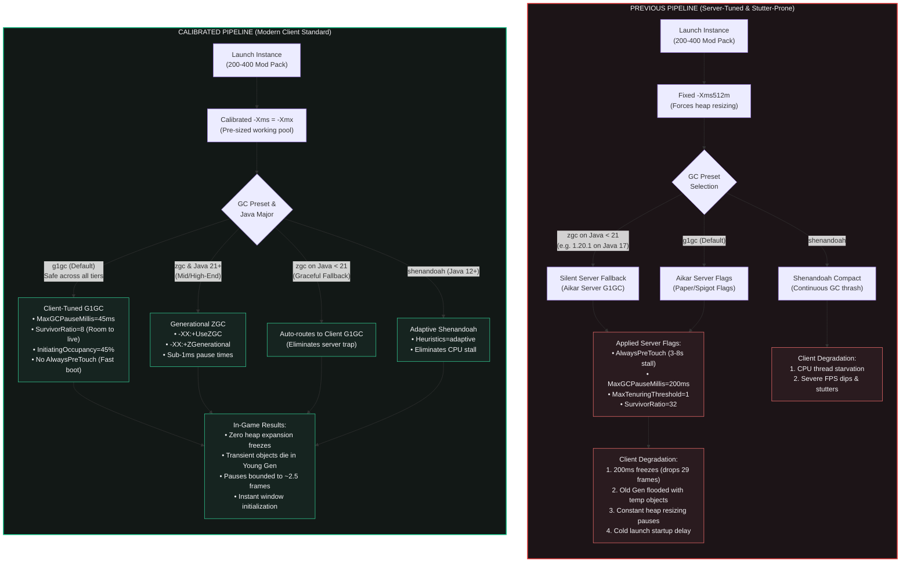

# Client GC Presets & JVM Arguments Calibration

## Overview & Goal

Garbage collection (GC) and JVM heap tuning are critical to Minecraft client responsiveness, frame pacing, and startup duration. Historically, Minecraft launchers and community guides blindly passed **Aikar's flags** (`-XX:MaxGCPauseMillis=200`, `-XX:MaxTenuringThreshold=1`, `-XX:SurvivorRatio=32`, `-XX:+AlwaysPreTouch`), which were engineered exclusively for **headless dedicated multiplayer servers** (Paper/Spigot), not local game clients.

On a client rendering at 60–144+ FPS, server-tuned parameters cause severe degradation:
1. **200ms Stop-The-World Pauses**: Dropping 12 to 29 consecutive frames, manifesting as hard visual freezes.
2. **Premature Old Gen Promotion (`MaxTenuringThreshold=1` & `SurvivorRatio=32`)**: Forcing short-lived transient mod objects (models, particle matrices, block states) into Old Gen after a single GC cycle, filling Old Gen and causing massive Mixed/Full GC stutters.
3. **Cold Startup Stall (`-XX:+AlwaysPreTouch`)**: Forcing the OS kernel to commit and zero-fill 8–12 GB of virtual pages before initializing the Minecraft window.
4. **Initial Heap Bottleneck (`-Xms512m`)**: Forcing the JVM to repeatedly trigger Stop-The-World heap expansions from 512 MB to 8 GB during mod loading (200–400 mods).
5. **CPU Thread Starvation (`ShenandoahGCHeuristics=compact`)**: Continually thrashing background collection cycles and stealing CPU cores from client render loops.

Vermeil modernizes this pipeline by replacing dedicated server flags with **Client-Tuned G1GC**, **Generational ZGC (Java 21+)**, and **Adaptive Shenandoah (Java 12+)**, calibrated across **Low-End**, **Medium-End**, and **High-End** hardware tiers.

---

## 1. Architectural Comparison: Old vs. New Pipeline

---

## 2. Direct Feature & Parameter Comparison

| Parameter / Behavior | Previous Legacy Implementation | Modern Calibrated Implementation | Impact on Client Gaming |
| :--- | :--- | :--- | :--- |
| **Initial Heap (`-Xms`)** | Hardcoded `-Xms512m` for every instance. | Calibrated to match effective `-Xmx` (`-Xms{max_mb}m`). | **Stops Heap Resizing Freezes**: Prevents JVM from pausing dozens of times to expand from 512 MB to 8 GB during 200–400 mod loading. |
| **Max GC Pause Goal** | `-XX:MaxGCPauseMillis=200` | `-XX:MaxGCPauseMillis=45` | **Eliminates Hard Freezes**: Capping pauses at 45ms (~2.5 frames at 60 FPS) prevents 200ms drops (29 consecutive frames at 144Hz). |
| **Object Tenuring** | `-XX:MaxTenuringThreshold=1` | JVM adaptive tenuring (JVM default, 8–15). | **Ends Old Gen Pollution**: Short-lived transient mod objects (models, particle spawns) die cheaply in Young Gen instead of clogging Old Gen. |
| **Survivor Space** | `-XX:SurvivorRatio=32` (shrinks survivor space to 1/34th of Young Gen). | `-XX:SurvivorRatio=8` (healthy 1/10th capacity). | **Prevents Premature Promotion**: Gives young objects room to survive 1–2 collection cycles and die naturally. |
| **Marking Threshold** | `-XX:InitiatingHeapOccupancyPercent=15`–`20` | `-XX:InitiatingHeapOccupancyPercent=45` (OpenJDK default). | **Stops Background GC Thrashing**: Prevents G1GC from running non-stop concurrent marking cycles that eat CPU. |
| **Page Pre-allocation** | `-XX:+AlwaysPreTouch` forced across all presets. | Omitted by default; memory committed lazily on-demand. | **Fast Cold Startup**: Saves 3–8 seconds of blank launch delay and prevents low-RAM systems from being pushed into disk swap. |
| **Shenandoah Tuning** | `-XX:ShenandoahGCHeuristics=compact` | `-XX:ShenandoahGCHeuristics=adaptive` | **Restores Client FPS**: Stops continuous compaction loops from stealing CPU cores from rendering and game ticks. |
| **Java 17 ZGC Fallback** | Silently fell back to Aikar's dedicated server flags. | Gracefully falls back to Client-Tuned G1GC. | **Eliminates Fallback Trap**: Heavy 1.20.1/1.19.2 packs no longer suffer from server-tuned freezes when ZGC is selected globally. |

---

## 3. Hardware Tier Calibration

| Hardware Tier | Recommended Preset | Architectural Rationale | Pitfalls Avoided |
| :--- | :--- | :--- | :--- |
| **Low-End** *(2–4 CPU cores, 4–8 GB total RAM)* | **Client-Tuned G1GC** *(Default)* | Low concurrent CPU usage leaves physical cores available for rendering and world ticks. Omitting `AlwaysPreTouch` prevents OS memory starvation. `MaxGCPauseMillis=45ms` preserves throughput. | **Never force ZGC on low-end:** ZGC's concurrent GC threads saturate 2–4 core CPUs. Never use `MaxTenuringThreshold=1`. |
| **Medium-End** *(6–8 CPU cores, 16 GB total RAM)* | **Client-Tuned G1GC** or **Generational ZGC** *(Java 21+)* | 6–8 cores easily absorb ZGC background threads. Pre-sizing `-Xms = -Xmx` eliminates dynamic heap resizing stutters on 200–400 modpacks. | Avoid `Shenandoah=compact` which starves CPU threads; `adaptive` provides clean frame pacing. |
| **High-End** *(8–16+ CPU cores, 32–64+ GB RAM)* | **Generational ZGC** *(Java 21+)* | Delivers sub-millisecond pauses (<1ms STW) even on 10–12 GB heaps with 400+ mods. Flawless frame pacing on 144Hz–240Hz monitors. | Server 200ms pauses drop 29 consecutive frames at 144Hz. Compact Object Headers on Java 25+ saves 10–15% memory overhead. |

---

## 4. Java HotSpot Flag Specification

### Client-Tuned G1GC (`g1gc`)
- `-XX:+UseG1GC`: Standard generational garbage collector.
- `-XX:MaxGCPauseMillis=45`: Bounded pause target (~2.5 frames at 60 FPS, imperceptible during gameplay).
- `-XX:+UnlockExperimentalVMOptions`: Universal compatibility toggle.
- `-XX:+DisableExplicitGC`: Prevents mods from invoking Stop-The-World `System.gc()`.
- `-XX:+UseStringDeduplication`: Deduplicates repeated string instances (registry names, NBT keys).
- `-XX:G1NewSizePercent=20` & `-XX:G1MaxNewSizePercent=40`: Balanced young generation sizing.
- `-XX:G1ReservePercent=15`: Headroom buffer against to-space exhaustion.
- `-XX:G1HeapWastePercent=5` & `-XX:G1MixedGCCountTarget=4`: Divides mixed reclamation into short, non-blocking slices.
- `-XX:InitiatingHeapOccupancyPercent=45`: OpenJDK default. Prevents early concurrent marking thrashing.
- `-XX:SurvivorRatio=8`: Restores normal survivor space capacity so transient objects die in Young Gen.
- `-XX:+ParallelRefProcEnabled`: Emitted for `java_major <= 8` (default in Java 9+).
- Region sizing: `-XX:G1HeapRegionSize=16M` when `memory_mb > 12288`, else `8M`.

### Generational ZGC (`zgc`)
- Gated to `java_major >= 21`.
- `-XX:+UseZGC`: Activates scalable low-latency collector.
- `-XX:+ZGenerational`: Generational partitioning for Java 21–22 (default in Java 23+).
- `-XX:+UseStringDeduplication`: Concurrent string deduplication.
- `-XX:TrimNativeHeapInterval=5000`: Trims unused native memory allocations.
- `-XX:+UseCompactObjectHeaders`: Emitted on Java 25+ (`java_major >= 25`).
- **Clean Fallback**: Instances running on Java < 21 (e.g. 1.20.1 Forge on Java 17) automatically fall back to Client-Tuned G1GC.

### Adaptive Shenandoah (`shenandoah`)
- Gated to `java_major >= 12`.
- `-XX:+UseShenandoahGC`: Low-latency collector.
- `-XX:ShenandoahGCHeuristics=adaptive`: Dynamically adjusts triggers based on allocation rates without starving game threads.
- `-XX:+DisableExplicitGC` & `-XX:+UseStringDeduplication`.
- **Clean Fallback**: Instances on Java < 12 automatically fall back to Client-Tuned G1GC.
