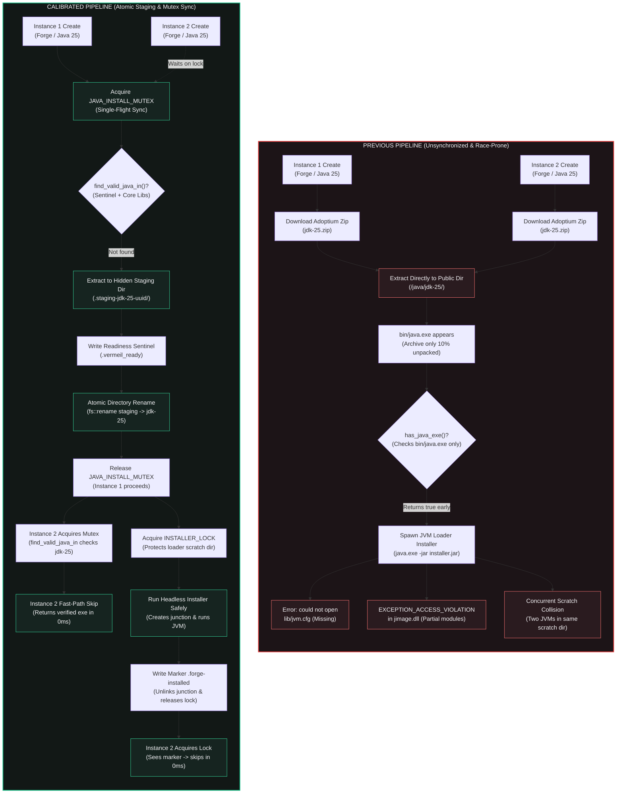

# Concurrent Runtime Provisioning & Loader Installer Synchronization

## Overview & Goal

When users rapidly create multiple instances in Vermeil (e.g. creating consecutive instances without pausing, or queueing multiple modpacks), the background engine prepares game versions, downloads libraries, acquires Java runtimes, and runs headless mod loader installers (Forge / NeoForge).

Historically, these tasks operated independently without single-flight synchronization or atomic extraction staging. When a user created multiple Forge or NeoForge instances on a clean install or after clearing the Java cache, this lack of coordination caused two catastrophic race conditions:

1. **JVM Startup Failure (`could not open '.../lib/jvm.cfg'`)**:
   - Adoptium runtime archives unpack hundreds of files. `bin/java.exe` is alphabetically early in the archive structure.
   - The preparation engine unpacked archives directly into the public `<data>/java/jdk-<version>` directory.
   - Concurrent tasks and downstream loader steps checked only for the presence of `bin/java.exe` via `has_java_exe()` or `find_java_exe_in()`.
   - As soon as `bin/java.exe` was written, concurrent threads immediately executed `java.exe -jar forge-installer.jar` while the extraction thread was still unzipping the archive.
   - When Java attempted to read `lib/jvm.cfg`, the file did not yet exist on disk, terminating the JVM with an immediate exit code.

2. **Modular Runtime Memory Crash (`EXCEPTION_ACCESS_VIOLATION in jimage.dll`)**:
   - In modern Java (Java 9 through 25), runtime classes are compiled into a large unified modular image at `lib/modules`.
   - When `java.exe` executed while the extraction thread was actively writing chunks to `lib/modules`, Java's native image reader (`jimage.dll`) read corrupted or partial bytes, triggering a fatal memory access violation (`0xc0000005`) that crashed the process.

3. **Installer Scratch Junction Collisions**:
   - Forge and NeoForge headless installers run inside a shared scratch directory (`cache/scratch/forge-<version>`) to avoid re-running the 15–40 MB processor pipeline per instance.
   - The installer uses an NTFS junction (`LibrariesLinkGuard`) pointing `<scratch>/libraries` to Vermeil's global libraries directory.
   - Concurrent instances targeting the same loader version ran installer processes inside the same scratch directory simultaneously, colliding on junction creation, unlinking, and file writes.

Vermeil eliminates these race conditions through **Single-Flight Concurrency Mutexes**, **Isolated Atomic Extraction Staging**, **Sentinel-Guarded Structural JRE Verification**, and **Loader Scratch Synchronization**.

---

## 1. Architectural Comparison: Old vs. New Pipeline



---

## 2. Direct Feature & Behavioral Comparison

| Dimension | Previous Implementation | Calibrated Implementation | User-Facing Impact |
| :--- | :--- | :--- | :--- |
| **Java Download & Extract Concurrency** | Unsynchronized; multiple instances downloaded and unpacked concurrently. | Serialized via `JAVA_INSTALL_MUTEX` single-flight mutex. | **Zero Race Conditions**: Eliminates duplicate downloads, network waste, and conflicting writes. |
| **Extraction Staging Directory** | Unpacked directly into public `<data>/java/jdk-<major>/`. | Unpacked into hidden staging directory (`.staging-jdk-<major>-<uuid>/`). | **Invisible In-Flight Writes**: Callers cannot inspect or observe partial files while extraction is underway. |
| **Publishing Mechanism** | In-place incremental writes file-by-file. | Atomic filesystem directory rename (`fs::rename`) with fallback. | **Atomic Availability**: The JRE directory appears on disk in an instantly complete state. |
| **Readiness Sentinel** | None. Assumed ready if `bin/java.exe` existed. | `.vermeil_ready` sentinel written only after 100% completion. | **Prevents Premature Execution**: No process can mistake a partially written directory for an active runtime. |
| **Structural JRE Validation** | Checked `dir.join("bin").join(exe).exists()`. | `find_valid_java_in` verifies `java.exe` AND (`lib/jvm.cfg` \| `lib/modules` \| `lib/rt.jar`). | **Eliminates Crashes**: Stops missing `jvm.cfg` errors and `jimage.dll` access violations completely. |
| **Corrupted Installation Recovery** | Left broken directories permanently on disk; manual deletion required. | Incomplete directories are automatically detected, purged, and healed. | **Self-Healing Engine**: Interrupted runs from system crashes or forced closures repair automatically. |
| **Loader Scratch Concurrency** | Unsynchronized; multiple instances wrote to same scratch junction concurrently. | Serialized via `INSTALLER_LOCK` async mutex in `services::neoforge`. | **Eliminates Junction Clobbering**: Prevents file locking collisions and corrupted loader libraries. |
| **Subsequent Instance Execution** | Re-ran or clashed on in-flight installer runs. | Waiting instance detects `.{loader}-installed` marker and finishes in 0ms. | **Instant Multi-Instance Creation**: Instantaneous setup for repeated instances sharing the same loader version. |
| **Code Consolidation** | 70+ lines of duplicate download/extract code across `launch.rs` and `java.rs`. | Consolidated into single source of truth: `services::java::ensure_java_major`. | **Ponytail Standard**: Fewer files touched, zero duplication, zero dead code warnings. |

---

## 3. Engineering Details

### 3.1 Single-Flight Synchronization (`JAVA_INSTALL_MUTEX`)
Located in [`src-tauri/src/services/java.rs`](file:///c:/Users/Kylle/Documents/Vermeil-Launcher/Vermeil/src-tauri/src/services/java.rs):
```rust
lazy_static::lazy_static! {
    static ref JAVA_INSTALL_MUTEX: tokio::sync::Mutex<()> = tokio::sync::Mutex::new(());
}
```
When `ensure_java_major(major)` or `install_from_archive(major, path)` is called:
1. Performs a fast lock-free check via `find_valid_java_in(&install_dir)`. If a valid JRE exists, it returns immediately.
2. If absent, it acquires `_lock = JAVA_INSTALL_MUTEX.lock().await`.
3. Performs a double-check under the lock (handling the case where a prior task finished while waiting for the mutex).
4. Proceeds with download and atomic staging.

### 3.2 Isolated Staging & Atomic Directory Rename
Extraction never writes directly to the destination folder:
```rust
let staging_id = uuid::Uuid::new_v4().to_string();
let staging_dir = java_dir.join(format!(".staging-jdk-{}-{}", major, &staging_id[..8]));
```
1. `crate::util::platform::extract_java_archive` unpacks into `staging_dir` on a background thread (`spawn_blocking`).
2. On successful extraction, writes `staging_dir.join(READY_SENTINEL)` (`.vermeil_ready`).
3. If an old incomplete directory exists at `install_dir`, it is purged.
4. `std::fs::rename(&staging_dir, &install_dir)` moves the entire directory tree atomically on the filesystem level.
5. If `fs::rename` encounters a temporary Windows handle lock, it falls back cleanly to `copy_dir_all(&staging_dir, &install_dir)` before unlinking the staging folder.

### 3.3 Structural Integrity Checking (`find_valid_java_in`)
Rather than verifying only the `bin/java.exe` file, `find_valid_java_in` enforces:
```rust
fn is_structurally_valid_jre(dir: &Path) -> bool {
    if dir.join(READY_SENTINEL).exists() {
        return true;
    }
    let lib = dir.join("lib");
    lib.join("jvm.cfg").is_file()
        || lib.join("modules").is_file()
        || lib.join("rt.jar").is_file()
}
```
This protects both Vermeil-managed auto-installed runtimes and external user/system JDKs from being referenced in an incomplete or corrupted state.

### 3.4 Loader Installer Serialization (`INSTALLER_LOCK`)
Located in [`src-tauri/src/services/neoforge.rs`](file:///c:/Users/Kylle/Documents/Vermeil-Launcher/Vermeil/src-tauri/src/services/neoforge.rs):
```rust
lazy_static::lazy_static! {
    static ref INSTALLER_LOCK: tokio::sync::Mutex<()> = tokio::sync::Mutex::new(());
}
```
Inside `ensure_installer_ran`:
```rust
let marker = instance_dir.join(format!(".{}-installed", marker_name));
let _lock = INSTALLER_LOCK.lock().await;

if !marker.exists() {
    // Run prefetch, establish junction guard, and run installer subprocess
    ...
    if let Err(e) = install_result {
        let _ = fs::remove_dir_all(instance_dir);
        return Err(e);
    }
    let _ = fs::write(&marker, "");
}
```
Waiting instances immediately skip execution when the lock becomes available because `marker.exists()` evaluates to `true`, instantly returning the generated `version.json` outputs without duplicate work.
