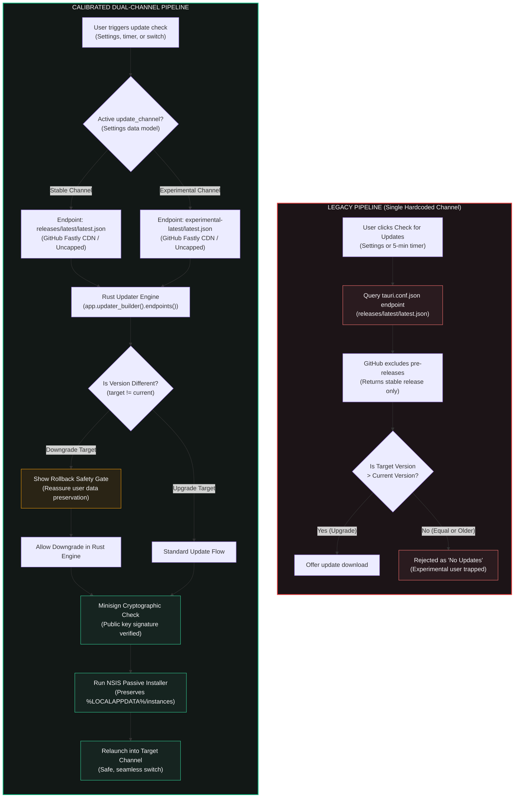

# Dual-Channel Release & Update Architecture

Committed research and technical specifications for Vermeil's bidirectional **Stable ↔ Experimental** update pipeline, dynamic endpoint routing, and cryptographic rollback mechanics.

---

## 1. Executive Summary & Problem Space

Previously, Vermeil's auto-updater queried a single endpoint defined in `tauri.conf.json` (`/releases/latest/download/latest.json`). While reliable for general releases, this design possessed three fundamental limitations:

1. **GitHub Pre-Release Exclusion**: GitHub Releases explicitly omits pre-releases from the `/releases/latest` API route and CDN redirect. Bleeding-edge experimental builds could not be delivered to users who wanted to opt in.
2. **One-Way Trap (No Safe Rollback)**: Standard SemVer update comparators strictly enforce `target_version > current_version`. A user testing an experimental build (e.g. `v1.3.0-experimental.1`) could never downgrade back to stable (e.g. `v1.2.0`) through the launcher without completely reinstalling from scratch.
3. **API Rate Limiting Risks**: Directly querying `https://api.github.com/repos/...` from unauthenticated desktop clients introduces a 60 requests/hour IP throttle, risking update check failures across shared networks.

---

## 2. Architectural Comparison: Old vs. Modern Pipeline



---

## 3. Direct Parameter & Operational Comparison

| Parameter / Capability | Legacy Implementation | Calibrated Dual-Channel System | Impact & User Benefit |
| :--- | :--- | :--- | :--- |
| **Endpoint Resolution** | Hardcoded in `tauri.conf.json` | Dynamically assigned via Rust `updater_builder().endpoints()` | Allows switching between channels without app re-compilation |
| **Experimental Discovery** | Inaccessible via launcher UI | Delivered via permanent `experimental-latest` CDN manifest | Users opt in with 1 click from Settings |
| **Rate Limit Overhead** | N/A (single CDN endpoint) | Zero rate limits (Fastly CDN edge for both channels) | Safe for thousands of users across university/dorm shared IPs |
| **Downgrade Mechanics** | Blocked by SemVer `target > current` | Version comparator `update.version != current` | Safe, one-click rollback to stable from any test build |
| **User Confirmation Gate** | None (impossible to rollback) | Dedicated tactile confirmation modal explaining data safety | Eliminates user fear of data loss during rollbacks |
| **Data Preservation** | Standard installer behavior | Isolated `%LOCALAPPDATA%/instances` directory untouched | Zero risk of world, mod, screenshot, or account loss |
| **Cryptographic Security** | Minisign signature verified | Minisign signature verified across both channels | Cryptographically authenticates both experimental and stable |

---

## 4. Technical Implementation Details

### A. Dynamic Endpoint Routing in Rust
Tauri 2's JS plugin wrapper (`@tauri-apps/plugin-updater`) does not expose endpoint configuration at the JavaScript layer. The routing logic is implemented in `src-tauri/src/services/app_updater.rs`:

```rust
pub async fn check_for_updates<R: Runtime>(
    webview: Webview<R>,
    channel: Option<String>,
    allow_downgrades: Option<bool>,
) -> Result<Option<UpdateMetadata>, String> {
    let mut builder = webview.updater_builder();

    let channel_name = channel.unwrap_or_else(|| "stable".to_string());
    let endpoint_url = if channel_name == "experimental" {
        "https://github.com/Davekb1976/Vermeil-Launcher/releases/download/experimental-latest/latest.json"
    } else {
        "https://github.com/Davekb1976/Vermeil-Launcher/releases/latest/download/latest.json"
    };

    let url = Url::parse(endpoint_url).map_err(|e| format!("Invalid updater URL: {}", e))?;
    builder = builder.endpoints(vec![url])?;

    if allow_downgrades.unwrap_or(false) {
        builder = builder.version_comparator(|current, update| update.version != current);
    }

    let updater = builder.build()?;
    let update = updater.check().await?;
    // ...
}
```

### B. Two-Tier Pre-Release CDN Synchronization
To bypass GitHub API rate limits, the release workflow (`.github/workflows/release.yml`) executes a post-build synchronization step whenever a pre-release tag (containing `-`) is published:
1. Matrix runners (`windows-2022` and `ubuntu-24.04`) build, sign, and upload platform installers to the tag.
2. `tauri-action` merges both Windows and Linux signatures into a single dual-platform `latest.json`.
3. The dependent `sync-experimental` job downloads this complete manifest and clobbers `experimental-latest` release assets.
4. Clients querying `https://github.com/Davekb1976/Vermeil-Launcher/releases/download/experimental-latest/latest.json` receive instant responses directly from GitHub's Fastly CDN edge.

### C. Data Safety Guarantee
All instance files, world saves, mod configurations, and credentials live in OS-managed application data folders:
- **Windows**: `%LOCALAPPDATA%\Vermeil\instances\`
- **Linux**: `~/.local/share/Vermeil/instances/`

Binary updates (both upgrades and rollbacks) execute via NSIS passive installer or AppImage binary replacement. The installer touches only `Program Files/Vermeil` (or `Local/Programs/Vermeil`) and never accesses, touches, or purges user instances. Settings resiliency is guaranteed by Serde defaults (`#[serde(default)]`), preventing crashes if an older stable release reads settings saved by a newer experimental build.
