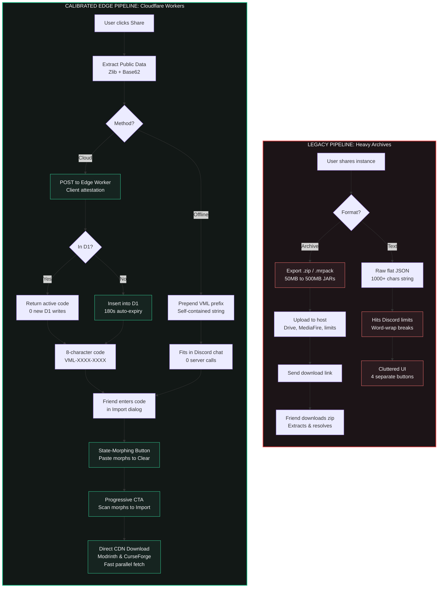
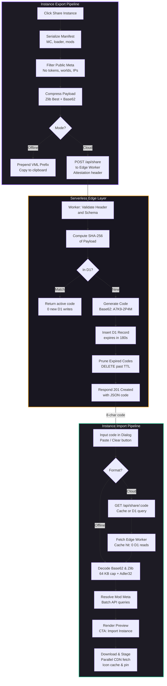

# Ephemeral Instance Share Codes & Edge Blueprints

## Overview & Goal

Sharing Minecraft modpacks and customized instances traditionally requires exporting large multi-megabyte `.zip` or `.mrpack` archives, finding a third-party file host, or manually transmitting mod lists. 

**Ephemeral Instance Share Codes** in Vermeil solves this with a **zero-login, zero-telemetry, 1-click sharing pipeline**:
1. **Cloud Share Codes (`VML-XXXX-XXXX`)**: An 8-character human-friendly code that resolves in seconds, backed by a serverless Cloudflare Worker and D1 SQL database with a strict 3-minute self-expiring TTL.
2. **Serverless Offline Blueprints (`VML...`)**: A 100% self-contained alphanumeric string encoding the entire instance manifest using Base62 chunking over Zlib-compressed JSON, requiring zero servers, accounts, or databases.

---

## 1. Architectural Comparison: Legacy vs. Modern Cloudflare Edge Pipeline



### Analysis of the Legacy Bottlenecks

1. **Bandwidth & Storage Bloat**:
   - Sharing a modest 100-mod instance as a `.zip` archive required packaging 150MB+ of binary jar files that already exist on public CDNs (Modrinth, CurseForge).
   - Users had to find third-party hosts or pay for file-sharing subscriptions, only to hit upload bandwidth ceilings or link expirations.
2. **Text Code Discord Limits & Formatting Corruption**:
   - Early string-based blueprint representations used uncompressed or flat JSON serialized into Base64.
   - For instances with 40+ mods, the string easily exceeded Discord's 2,000-character single-message ceiling, forcing users into multi-message pastes or `.txt` file attachments.
   - Base64 symbols (`+`, `/`, `=`) triggered markdown italics or required double-clicks that fractured across punctuation boundaries.
3. **UI Friction & Sizing Asymmetry**:
   - The legacy import screen presented separate `[Paste]` and `[Clear]` buttons with mismatched heights (26px small buttons beside a 32px text input), creating visual clutter and ragged layout baselines.
   - Separate `[Scan Code]` and `[Import Instance]` buttons competed for prominence, introducing ambiguity about the next user action.

---

## 2. End-to-End Pipeline Architecture



---

## 3. Blueprint Codec & Serialization

### Data Model (`ShareCodePayload`)
The blueprint data model represents the exact composition of an instance using minimal primitives:

```rust
pub struct ShareCodePayload {
    pub v: u8,                              // Format schema version (currently 3)
    pub name: String,                       // Instance display name
    pub mc: String,                         // Minecraft version (e.g., "1.21.1")
    pub loader: String,                     // Mod loader ("fabric", "forge", "neoforge", "quilt", "vanilla")
    pub loader_version: Option<String>,     // Specific loader build (e.g., "0.16.9")
    pub items: Vec<ShareItemTuple>,         // Compact item array
    pub bp: Option<BasePackRef>,            // Upstream modpack reference (if based on .mrpack / CF pack)
}
```

### Compact Item Tuples (`ShareItemTuple`)
To minimize uncompressed JSON footprint before zlib compression, items are stored as 5-element positional tuples rather than verbose struct maps:
```rust
pub struct ShareItemTuple(
    pub u8,      // 0 = Modrinth, 1 = CurseForge
    pub String,  // project_id (slug or numeric ID)
    pub String,  // version_id (release hash or file ID)
    pub u8,      // 0 = mod, 1 = shader, 2 = resourcepack
    pub bool,    // enabled status
);
```

### Compression & Base62 Encoding
1. **JSON Serialization**: Compact serde serialization (`serde_json::to_vec`).
2. **Zlib Best Compression**: `ZlibEncoder::new(Vec::new(), Compression::best())` achieves 65–85% compression ratios on mod manifests.
3. **Base62 Chunked Encoding**: Rather than Base64 (which includes `+`, `/`, and `=` padding characters that break word selection in Discord or browsers), the compressed bytes are converted into Base62 (`[0-9A-Za-z]`).
   - Double-clicking any part of the string in Discord, chat apps, or browsers selects the entire code cleanly without splitting on delimiters or triggering Markdown formatting.
4. **Header Identifier**: Prefixed with `VML` (e.g. `VML...` for offline codes, `VML-XXXX-XXXX` for cloud codes). Legacy `VLM`, `VML1`, and `VLM1` prefixes remain backward compatible.

---

## 4. Serverless Edge Relay (Cloudflare Workers + D1)

### Cloudflare Worker Responsibilities
The relay lives at `https://share.vermeillauncher.workers.dev` and performs 4 essential functions:

1. **Client Attestation Header**:
   - Every request from Vermeil includes `X-Vermeil-Client: vml_app_sec_...`.
   - Unauthorized scrapers, generic bots, or non-launcher requests are immediately rejected with `403 Forbidden` before querying the database.
2. **Payload Deduplication via SHA-256**:
   - When a user exports an instance, the worker computes `SHA-256(payload)`.
   - The worker executes `SELECT id, expires_at FROM share_codes WHERE payload_hash = ? AND expires_at > ?`.
   - If an identical payload was already exported and remains unexpired, the existing 8-character code is returned with `200 OK` (`deduplicated: true`). **Zero redundant rows are written to D1.**
3. **Strict 3-Minute Expiration (TTL)**:
   - Newly inserted codes have `expires_at = unix_now + 180`.
   - On every write operation, the worker performs opportunistic cleanup: `DELETE FROM share_codes WHERE expires_at < ?`.
   - Read requests (`GET /api/share/:code`) query `WHERE id = ? AND expires_at > ?`. Expired codes immediately return `404 Not Found`.
4. **Edge Cache Acceleration (`caches.default`)**:
   - GET responses set `Cache-Control: public, max-age=180`.
   - Successfully resolved codes are stored in Cloudflare's Edge Cache (`caches.default`). Repeated reads across multiple clients resolve at edge data centers with **0 D1 database reads**.

### D1 Database Schema
```sql
CREATE TABLE IF NOT EXISTS shares (
    code TEXT PRIMARY KEY,           -- 13-char code (e.g. 'VML-A7K9-2P4M')
    payload TEXT NOT NULL,           -- Compressed or compact JSON payload (<= 64 KB)
    content_hash TEXT NOT NULL,      -- SHA-256 hex string of the blueprint payload
    created_at INTEGER NOT NULL,     -- Unix epoch in seconds
    expires_at INTEGER NOT NULL      -- Unix epoch in seconds (created_at + 180)
);

CREATE INDEX IF NOT EXISTS idx_shares_expires ON shares (expires_at);
CREATE INDEX IF NOT EXISTS idx_shares_hash ON shares (content_hash);
```

---

## 5. Security & Privacy Boundary

### Strict Data Isolation
The blueprint generation process in `src-tauri/src/services/share_code.rs` explicitly serializes only public project identifiers.

| Data Category | Transmitted? | Rationale |
| :--- | :---: | :--- |
| **Minecraft Version & Loader** | **Yes** | Required to construct the game runtime environment. |
| **Mod / Shader / Pack IDs** | **Yes** | Public IDs from Modrinth (`api.modrinth.com`) and CurseForge (`api.curseforge.com`). |
| **Instance Display Name** | **Yes** | User-friendly label for the imported instance. |
| **Microsoft / Xbox Tokens** | **NEVER** | Kept in local OS encrypted storage (`accounts.json` / DPAPI). |
| **Player UUIDs & Gamertags** | **NEVER** | Instance blueprints are account-agnostic. |
| **World Saves (`saves/`)** | **NEVER** | Never included; blueprints configure environments, not game states. |
| **Multiplayer Servers (`servers.dat`)** | **NEVER** | Server IPs and saved connections are excluded. |
| **System Paths & Machine Specs** | **NEVER** | No local file paths or machine names are serialized. |

### Decompression Bomb Defense
To prevent denial-of-service via maliciously crafted compression payloads:
1. **Raw String Cap**: Offline code strings are capped at 16,384 characters (`MAX_CODE_CHARS`).
2. **Bounded Decompression**: The `ZlibDecoder` is wrapped with `std::io::Read::take(65_536)` (64 KB ceiling). Any payload expanding beyond 64 KB is terminated and rejected immediately.
3. **Integrity Validation**: Zlib Adler-32 checksums are strictly verified by `flate2`; tampered bytes cause instant decompression failure without crashing.

---

## 6. UI/UX Tactile Integration

The import interface adheres to Vermeil's **SloppyKeys** design system and UI restraint guidelines:

1. **State-Morphing Trailing Input Slot**:
   - Instead of separate `[Paste]` and `[Clear]` buttons, a single companion square button (32×32px, `var(--control-height-md)`) morphs dynamically:
     - Empty input &rarr; `<IconClipboard />` with `data-tip="Paste from clipboard"`.
     - Filled input &rarr; `<IconX />` with `data-tip="Clear input"`.
2. **Single Progressive CTA Button**:
   - The primary right-sidebar action button starts as `[Scan Code]`.
   - Once scanned and the live mod list preview is loaded, that exact same button morphs into `[Import Instance]`.
   - Modifying or clearing the input automatically resets the button state back to `[Scan Code]`.
3. **Companion Height Symmetry**:
   - Input field and trailing action button maintain exact height token parity (`--control-height-md` = 32px), with `align-self: stretch` to eliminate ragged boundaries.
