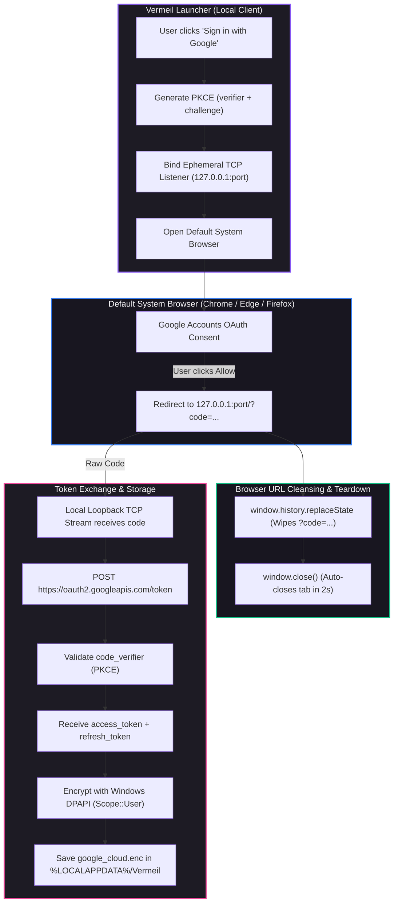
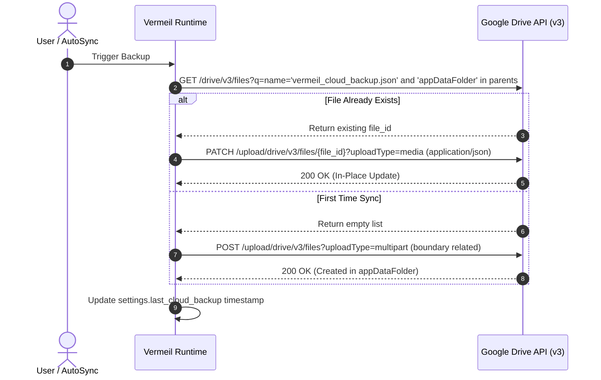
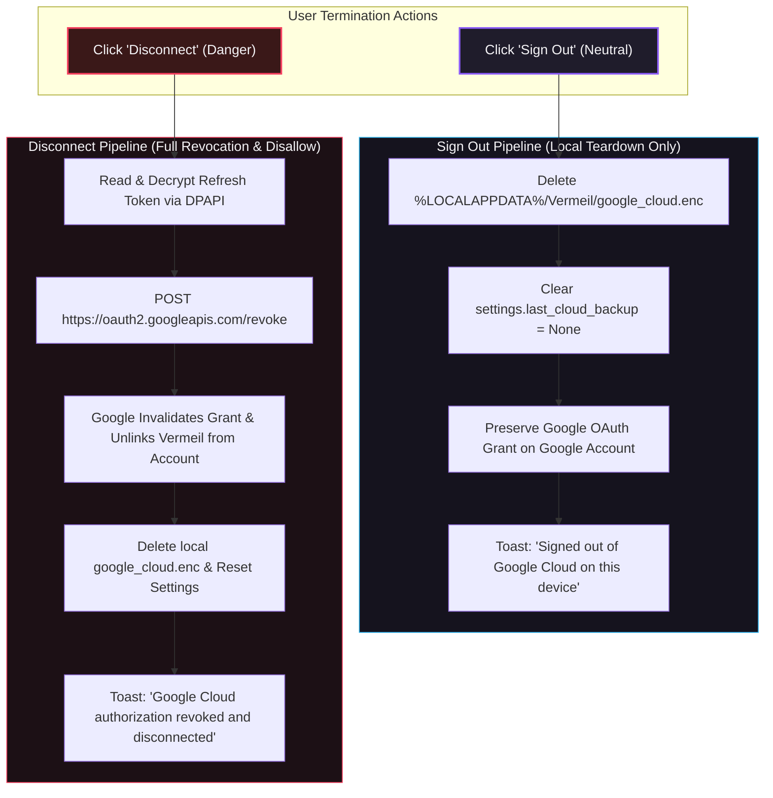

# Google Cloud Settings Sync (Zero-Telemetry Backup & Restore)

## Overview & Goal

Vermeil provides a cross-device settings backup and restore system utilizing **Google Drive's sandboxed Application Data Folder (`appDataFolder`)**. The goal is seamless, zero-maintenance profile migration for players moving between devices (e.g., desktop to gaming laptop, fresh Windows reinstalls) without requiring Vermeil to host any proprietary backend databases, user accounts, or telemetry servers.

---

## 1. Security & Privacy Architecture

The system is built on **RFC 7636 (PKCE)**, **RFC 8252 (OAuth 2.0 for Native Apps)**, and **Google API Services User Data Policy** guidelines.



### Core Security Guarantees:
1. **Google Scope Minimization (`drive.appdata`):**
   * Vermeil requests only `https://www.googleapis.com/auth/drive.appdata`.
   * Under this scope, **Vermeil cannot view, list, read, or modify any personal Google Drive files** (no documents, sheets, photos, or general drives).
   * The app is restricted to a hidden, dedicated app sandbox managed directly by Google Drive.
2. **System Browser Mandate (RFC 8252):**
   * Google prohibits OAuth 2.0 requests inside embedded webviews (`403: disallowed_useragent`).
   * Authentication is initiated exclusively through the operating system's default browser, protecting users against credential-sniffing and preserving user browser session security.
3. **Local Encryption (Windows DPAPI / Unix 0600):**
   * The refresh token is encrypted at rest using Windows DPAPI (`windows_dpapi::encrypt_data` with `Scope::User`), tying the stored token directly to the user's active Windows credentials.
4. **Instant URL Cleansing:**
   * Upon receiving the callback code, the loopback server serves an HTML landing page executing `window.history.replaceState({}, document.title, window.location.pathname)`. This instantly purges authorization query parameters from the browser history and address bar.

### The Desktop Client Secret & Public Client Model (RFC 8252 & Google Documentation)

In traditional web applications running on secure remote servers, client secrets are kept strictly confidential. However, for native desktop applications (like Vermeil, VS Code, Git Credential Manager, or Cyberduck), the application executes locally on the end user's device.

1. **RFC 8252 (OAuth 2.0 for Native Apps) & RFC 6749:**
   * [RFC 8252 Section 8.5](https://datatracker.ietf.org/doc/html/rfc8252#section-8.5) explicitly states:
     > *"Native apps are incapable of using client authentication, as they cannot maintain the confidentiality of their credentials. Consequently, client secrets used in native apps MUST NOT be treated as confidential."*
2. **Google's Official Stance:**
   * Google's developer documentation for desktop and installed apps ([Using OAuth 2.0 to Access Google APIs](https://developers.google.com/identity/protocols/oauth2)) explicitly notes:
     > *"The process results in a client ID and, in some cases, a client secret, which you embed in the source code of your application. **(In this context, the client secret is obviously not treated as a secret.)**"*
   * Even when PKCE is used, Google's `/token` endpoint mandates that the `client_secret` issued for the installed desktop client ID is present in the POST body to route API quotas.
3. **Why this poses zero security risk:**
   * **No Administrative Authority:** The desktop client secret carries zero access to your Google account, personal Drive, or Google Cloud billing.
   * **User Consent Barrier:** A user must authenticate into their *own* Google account in their default browser to grant access to their *own* sandboxed `appDataFolder`.
   * **PKCE Protection (RFC 7636):** Code interception is physically prevented by the single-use in-memory `code_verifier` generated independently on each sign-in.

---

## 2. Data Separation & Sanitization Matrix

Not all settings should be synchronized across computers. Machine-specific parameters (such as display aspect ratios, RAM limits, and filesystem paths) must remain strictly local to prevent hardware configuration mismatch.

```mermaid
flowchart LR
    subgraph LocalSettings["LauncherSettings (Memory / Disk)"]
        G1["General Settings"]
        D1["Display Toggles (FPS, VSync, FOV, Gamma)"]
        S1["Sound Levels (Master, Music, Weather, Hostile)"]
        K1["Custom Keybinds"]
        M1["Memory Allocation (RAM MB, Adaptive RAM)"]
        W1["Window Dimensions (Width, Height, Maximized)"]
        J1["Java Runtimes & Custom JDK Paths"]
        C1["Controls & Accessibility (Mouse, Subtitles)"]
    end

    subgraph Sanitizer["sanitize_settings_for_cloud()"]
        Filter{"Is Setting Machine-Specific?"}
    end

    subgraph CloudPayload["VermeilCloudBackup (appDataFolder)"]
        CP_G["General Settings"]
        CP_D["Display Toggles"]
        CP_S["Sound Levels"]
        CP_K["Keybinds"]
    end

    subgraph LocalOnly["Local Machine Only (%LOCALAPPDATA%)"]
        LP_M["RAM Allocation"]
        LP_W["Window Dimensions"]
        LP_J["Java Paths & Presets"]
        LP_C["Mouse & Controls"]
    end

    G1 & D1 & S1 & K1 --> Filter -->|No (Portable)| CloudPayload
    M1 & W1 & J1 & C1 --> Filter -->|Yes (Hardware-Specific)| LocalOnly

    style LocalSettings fill:#1d1b24,stroke:#64748b,stroke-width:1px,color:#f4f3f6
    style Sanitizer fill:#181620,stroke:#8b5cf6,stroke-width:2px,color:#f4f3f6
    style CloudPayload fill:#0f172a,stroke:#10b981,stroke-width:2px,color:#f4f3f6
    style LocalOnly fill:#0f172a,stroke:#f59e0b,stroke-width:2px,color:#f4f3f6
```

### Classification Table:
| Category | Fields | Destination | Rationale |
| :--- | :--- | :--- | :--- |
| **General** | `close_on_launch`, `popout_logs`, `auto_update`, `discord_rpc`, `show_snapshots`, `splash_screen`, `download_toasts`, `auto_hide_dock`, `pagination_position` | **Google Cloud** | Universal user launcher preferences. |
| **Display** | `max_fps`, `vsync`, `gui_scale`, `gamma`, `fov` | **Google Cloud** | In-game visual quality preferences. |
| **Sound** | `master_volume`, `music_volume`, `weather_volume`, `hostile_volume`, `block_volume`, `player_volume` | **Google Cloud** | Audio balance preferences. |
| **Keybinds** | `keybinds: HashMap<String, String>` | **Google Cloud** | Muscle-memory keyboard shortcuts. |
| **Memory** | `default_memory_mb`, `adaptive_ram`, `adaptive_ram_min_mb`, `adaptive_ram_max_mb` | **Local Only** | Machine-dependent (e.g. 8GB laptop vs 64GB desktop). |
| **Window** | `window_width`, `window_height`, `start_maximized` | **Local Only** | Monitor-dependent (e.g. 1080p vs 4K ultrawide). |
| **Java** | `java_runtime`, `java_paths`, `gc_preset` | **Local Only** | Absolute filesystem paths and architecture differ per OS/PC. |
| **Controls** | `mouse_sensitivity`, `invert_y_mouse`, `fov_effects`, `view_bobbing`, `auto_jump` | **Local Only** | DPI and hardware dependent. |

---

## 3. Cloud Storage & Conflict-Free In-Place Update

Vermeil never generates duplicate backup files in the user's cloud account. It follows an **idempotent single-file topology**:



---

---

## 4. Session Termination: Sign Out vs. Disconnect (Revoke)

Vermeil provides two distinct session teardown paths with separate intent and blast radius:



### Path 1: Sign Out (Local Teardown)
- **Use Case:** Switching local profiles, setting up a shared device, or pausing sync on this specific computer.
- **Behavior:**
  1. Purges `%LOCALAPPDATA%/Vermeil/google_cloud.enc`.
  2. Resets `last_cloud_backup` timestamp in `settings.json`.
  3. **Does NOT contact Google's `/revoke` endpoint.**
  4. The OAuth authorization grant remains active on the user's Google Account under [Third-party apps & services](https://myaccount.google.com/connections). If the user signs in again on this or another machine, Google does not require full re-consent from scratch.

### Path 2: Disconnect (Revoke Access & Disallow App)
- **Use Case:** Completely revoking Vermeil's access to the user's Google Drive sandbox and removing the app from their Google Account.
- **Behavior:**
  1. Reads and decrypts the active refresh token with Windows DPAPI.
  2. Sends an authenticated POST request to Google's revocation endpoint:
     `POST https://oauth2.googleapis.com/revoke?token={refreshToken}`
  3. Google invalidates all issued tokens and removes Vermeil from the user's connected third-party applications list.
  4. Purges local `google_cloud.enc` and resets settings.

---

## 5. Schema & Future-Proofing

The serialized backup format encapsulates an explicit `format_version`:

```json
{
  "format_version": 1,
  "created_at": "2026-09-23T02:39:19Z",
  "app_version": "1.1.1",
  "settings": {
    "discord_rpc": true,
    "video_settings": {
      "max_fps": 260,
      "master_volume": 0.8
    },
    "keybinds": {
      "open_search": "Ctrl+K"
    }
  },
  "pinned_instances": []
}
```

* **Serde Forward/Backward Compatibility:** All newly introduced fields use `#[serde(default)]`. If an older launcher version encounters a newer backup, unknown fields are discarded safely. If a newer launcher reads an older backup, missing fields fall back to default values.
