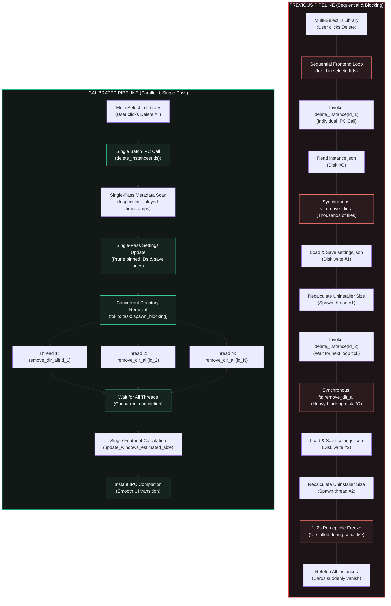

# Library Architecture & High-Concurrency Batch Deletion

## Overview & Goal

The Library screen serves as Vermeil's primary dashboard for managing, inspecting, and organizing local Minecraft instances. As instance libraries scale from a couple of testing profiles to dozens of heavily-modded configurations, two primary architectural challenges emerge:

1. **Deletion Latency & Main-Thread Blocking**:
   - Deleting multiple instances previously operated as a sequential frontend loop that called single-instance deletion one-by-one.
   - Each individual deletion synchronously unlinked large directory trees (often containing thousands of mod files, asset indexes, and world saves), re-read and wrote launcher configuration, and repeatedly triggered Windows uninstaller disk footprint calculations.
   - For users selecting 3 to 10 instances, this created a noticeable 1–2 second freeze where the interface stalled before all instances disappeared.

2. **Visual Hierarchy & Discovery in Large Libraries**:
   - A single flat card grid with scattered or missing filters lacked structure for distinguishing between active daily drivers ("Favorites" or "Pinned" instances) and experimental or inactive modpacks.
   - Brand-new launcher installations displayed an empty void with a lone dashed card, offering no clear path toward creating or importing instances.
   - Action affordances like multi-select used misleading icons (identical to the dock icon) and suffered from edge tooltip clipping.

Vermeil addresses these challenges with **High-Speed Parallel Batch Deletion**, **Dual-Shelf Organizational Hierarchy**, **Tactile Filter Chips & Instant Search**, and a **Sunken Guided Empty-State Hero**.

---

## 1. Architectural Comparison: Old vs. New Pipeline



---

## 2. Direct Feature & Behavioral Comparison

| Dimension | Previous Implementation | Calibrated Implementation | User-Facing Impact |
| :--- | :--- | :--- | :--- |
| **Deletion Execution** | Serial frontend loop invoking `delete_instance` per ID. | Single backend command `delete_instances(ids)` unlinking directories in parallel via `spawn_blocking`. | Eliminates the 1–2 second freeze; batch deletion completes near-instantaneously. |
| **Configuration I/O** | `settings.json` reloaded, edited, and written once per deleted instance. | `settings.json` updated and written exactly once for the entire batch. | Reduces disk write cycles and prevents file lock contention. |
| **Windows Footprint Sync** | Re-scanned and updated registry once per deleted instance. | Single deferred recalculation executed after all directory threads complete. | Eliminates redundant background thread spawns and registry writes. |
| **Multi-Select Icon** | `<IconGrid />` (identical to the Dock Library navigation icon). | `<IconTrash2 />` with toggle state and responsive badge. | Obvious, unambiguous affordance indicating deletion mode. |
| **Tooltip Positioning** | Centered `tip-below` clipping past the right viewport margin. | Right-anchored `tip-below tip-right` keeping tooltip content on screen. | Crisp, legible tooltips regardless of window size. |
| **Library Organization** | Flat unordered grid; minimal filtering. | Dual-Shelf layout: `// PINNED FAVORITES` (with quick-access modal trigger) and `// ALL INSTANCES`. | Immediate access to favorite profiles without visual clutter. |
| **Filtering & Search** | Limited search; out-of-place controls. | Tactile filter pills (`All`, `★ Pinned`, `Played`, `Unplayed`, Loader chips) + live text search with quick clear. | Instant profile discovery across large collections. |
| **Empty State** | Empty void with a solitary dashed card. | Framed sunken `#0f0e13` Hero Panel with Vermeil logo and 3 clear action entry points. | Welcoming, self-explanatory onboarding for new users. |

---

## 3. Concurrency & Parallel Unlinking Engine

### Single-Pass Configuration Consolidation

When multiple instances are deleted simultaneously, their identifiers must be purged from `sidebar_pinned_instances` and the launcher's `last_active_at` timestamp must be resolved. The legacy implementation repeated this sequence $N$ times.

In `delete_instances(ids: Vec<String>)`:
1. Metadata for all target instances is examined upfront to capture the highest `last_played` timestamp.
2. The pinned instances list is filtered against a `HashSet<String>` of deleted IDs.
3. If settings were altered, `settings_service::save()` is called exactly once.

### Concurrent Thread Unlinking

Directory unlinking in Windows NTFS can incur significant overhead when deleting trees with nested directories and thousands of small files (common in heavily-modded instances with shaderpacks, mods, and resource packs):

```rust
let mut handles = Vec::new();
for id in ids {
    let dir = instances_dir.join(id);
    handles.push(tokio::task::spawn_blocking(move || {
        if dir.exists() {
            let _ = std::fs::remove_dir_all(&dir);
        }
    }));
}

for handle in handles {
    let _ = handle.await;
}
```

Offloading each instance deletion to Tokio's blocking threadpool allows the underlying OS filesystem driver to interleave I/O requests concurrently across CPU cores rather than stalling the async runtime or serializing disk latency.

---

## 4. Dual-Shelf UI Hierarchy & SloppyKeys Styling

### 1. Pinned Favorites Shelf
Instances pinned for quick access (matching the floating dock's launcher list) are elevated to an exclusive `// PINNED FAVORITES` section:
- Styled with `.card-section-tag.tag-settings-accent` and gold `.badge--pinned` accents.
- Includes a direct `Manage Pins` button triggering `PinInstancesModal` without navigating away to Settings.
- Automatically collapses when search or specific loader filters are active to prevent visual duplication.

### 2. All Instances & Filter Pills
- Filter pills (`.library-filter-pill`) feature flat surfaces, hairline borders, and tactile `--bevel` shadows on active states.
- The `[UNPLAYED]` status badge (`.badge--unplayed`) visually segregates newly created or unlaunched profiles from established installations.

### 3. Tactile Empty State Hero
For zero-instance environments, the view renders a prominent `.library-empty-panel`:
- Recessed `#0f0e13` sunken well background with a 3px accent left border (`border-left: 3px solid var(--accent)`).
- Clear CTA buttons for creating a clean instance, browsing community modpacks (Modrinth/CurseForge), or importing `.mrpack` / `.zip` archives.
