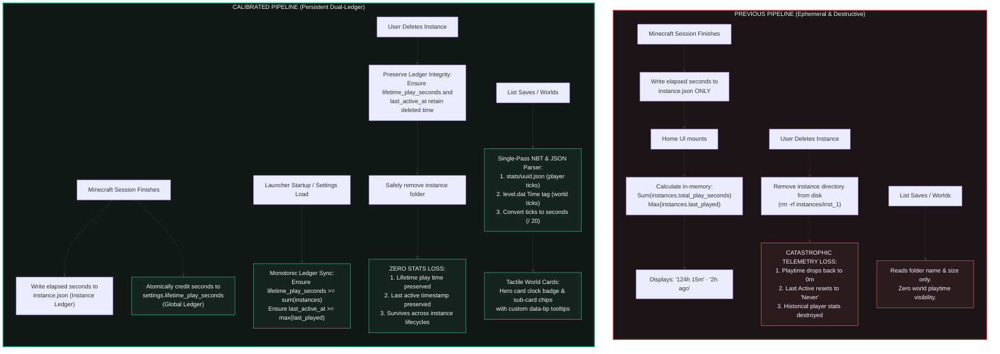

# Persistent Lifetime Activity & Per-World Playtime Architecture

## Overview & Goal

In previous versions of Vermeil, user activity tracking ("Play Time" and "Last Active" displayed in the Home commander stage and telemetry headers) suffered from a fundamental architectural flaw:
- **Ephemeral Calculation**: Playtime and last active timestamps were calculated on-the-fly by summing `total_play_seconds` and sorting `last_played` across whatever instance directories currently existed on disk in `%LOCALAPPDATA%\Vermeil\instances`.
- **Destructive Deletion**: When an instance was deleted, its recorded hours and activity dates were destroyed with its folder. If a player deleted their main instance or cleared instances, their launcher playtime abruptly dropped back to `0m` and Last Active reset to `"Never"`, wiping away dozens or hundreds of hours of accumulated Minecraft history.
- **World Tracking Blindspot**: World cards (Hero World card and 2x2 sub-cards on `Home.tsx`, and the Worlds tab in `InstanceMods.tsx`) displayed file size and game mode, but completely lacked playtime tracking. Players had no in-launcher visibility into how much time they had spent in specific singleplayer worlds.

This document outlines the **Dual-Ledger Telemetry Architecture** and **Single-Pass World NBT/JSON Scanner** that solve both issues with zero third-party dependencies, bounded I/O, and mathematical monotonicity.

---

## 1. Architectural Comparison: Old vs. New Pipeline



---

## 2. Direct Feature & Behavioral Comparison

| Capability | Legacy Implementation | Modern Implementation | User & System Impact |
| :--- | :--- | :--- | :--- |
| **Telemetry Persistence** | Bound solely to ephemeral `instance.json` files on disk. | **Dual-Ledger**: Stored in `LauncherSettings` (`lifetime_play_seconds` & `last_active_at`) + `Instance`. | Lifetime stats persist permanently across instance deletions, reinstalls, and instance pruning. |
| **Instance Deletion** | Deleting an instance immediately deleted its accumulated hours from the launcher. | Atomic sync safeguards global ledger prior to directory removal (`rmdir`). | Deleting an instance never drops total hours or resets "Last Active". |
| **Pre-existing / Imported Instances** | Imported instances only counted while the directory existed. | **Monotonic Upward Sync**: `settings_service::load()` automatically syncs `lifetime_play_seconds` if `sum(disk) > lifetime`. | Users migrating existing modpacks or instances immediately have their historical playtime absorbed into the launcher. |
| **Cloud Synchronization** | Google Cloud sync did not backup or restore global playtime. | Preserved in cloud settings; merged using `max(local, cloud)` logic upon restore. | Cross-machine synchronization never rolls back or overwrites playtime. |
| **Per-World Playtime** | Not supported. World cards showed only folder name, game mode, and file size. | Reads player statistics from `stats/*.json` with fallback to `level.dat` `Time` tag. | Players can see exact playtime per world (`Xh Ym`) in the Hero Continue card, 2x2 grid, and Worlds tab. |
| **NBT & JSON Parser Efficiency** | NA (only read string from `level.dat` for world name). | Single-pass GzDecoder with binary tag signatures (`LevelName`, `Time`, `GameType`, `hardcore`, `LastPlayed`). | Zero new crates required; reads small saves in sub-millisecond execution. |

---

## 3. Mathematical Monotonicity Guarantee

A core requirement of lifetime telemetry is **monotonic non-decreasing progression**:
$$\text{lifetime\_play\_seconds}_{t+1} \ge \text{lifetime\_play\_seconds}_{t}$$

Vermeil enforces this guarantee across all 4 system transition boundaries:

1. **Active Game Session Termination (`services/launch.rs`)**:
   ```rust
   if elapsed_secs > 0 {
       if let Ok(mut settings) = crate::services::settings_service::load().await {
           settings.lifetime_play_seconds = settings.lifetime_play_seconds.saturating_add(elapsed_secs);
           let _ = crate::services::settings_service::save(&settings).await;
       }
   }
   ```
2. **Startup & Settings Load (`services/settings_service.rs`)**:
   ```rust
   let mut sum_play = 0u64;
   for inst in disk_instances {
       sum_play = sum_play.saturating_add(inst.total_play_seconds);
   }
   if sum_play > settings.lifetime_play_seconds {
       settings.lifetime_play_seconds = sum_play;
   }
   ```
3. **Instance Deletion (`commands/instances.rs`)**:
   Settings are loaded and persisted **before** `std::fs::remove_dir_all(&instance_dir)`. The load operation guarantees that any playtime or recent activity belonging to the instance about to be destroyed is already absorbed into the global ledger.
4. **Google Cloud Sync Restore (`services/google_cloud.rs`)**:
   ```rust
   local.lifetime_play_seconds = local.lifetime_play_seconds.max(cloud.lifetime_play_seconds);
   ```

---

## 4. Single-Pass World Telemetry Scanner

Minecraft saves world data using two distinct formats:
1. **`saves/<world>/level.dat` (Gzipped NBT)**:
   - `Time` (`TAG_Long`, 0x04): Total game ticks elapsed since world generation.
   - `LastPlayed` (`TAG_Long`, 0x04): Epoch millisecond timestamp of last world save.
   - `GameType` (`TAG_Int`, 0x03): Default game mode (0: Survival, 1: Creative, 2: Adventure, 3: Spectator).
   - `hardcore` (`TAG_Byte`, 0x01): Boolean flag indicating Hardcore mode.
   - `LevelName` (`TAG_String`, 0x08): In-game display name of the world.
2. **`saves/<world>/stats/<uuid>.json` (JSON)**:
   - Modern (1.13+): `stats["minecraft:custom"]["minecraft:play_time"]` or `minecraft:total_world_time` (ticks).
   - Legacy (1.7–1.12): `stat.playOneMinute` (ticks).

### Extraction Algorithm (`commands/files.rs`)
- In `parse_level_dat()`, the launcher reads `level.dat` into memory, decompresses it via `flate2::read::GzDecoder`, and searches for tag binary byte signatures without constructing a full generic DOM tree.
- In `read_player_play_time()`, the launcher inspects the `stats/` directory for player UUID files, parsing the player-specific ticks.
- If player stats exist, player ticks take precedence; otherwise, `level.dat`'s `Time` ticks are used as fallback.
- Ticks are converted to seconds via integer division:
  $$\text{play\_time\_seconds} = \lfloor \frac{\text{ticks}}{20} \rfloor$$

---

## 5. UI Presentation & Design System Compliance

Vermeil strictly enforces the SloppyKeys design language (tactile tokens, sharp corners, recessed wells, no button bevels on informational readouts, and zero native HTML `title` attributes):

1. **Hero World Continue Card (`Home.tsx`)**:
   - Renders `.badge--playtime` with `<IconClock>` and tactile tooltip `data-tip="Time played in this world"`.
2. **Recent Worlds 2x2 Grid (`Home.tsx`)**:
   - Renders `.world-card-playtime` chip with hairline divider (`.world-card-sep`) and formatted duration.
3. **Worlds Manager Tab (`InstanceMods.tsx`)**:
   - Inlines world thumbnail, game mode, disk size, and formatted playtime in the list item summary.
4. **Header Telemetry Plate (`Home.tsx`)**:
   - Dynamically evaluates `Math.max(current_instances_sum, global_lifetime)` and shows lifetime hours even when 0 instances remain in the library.
