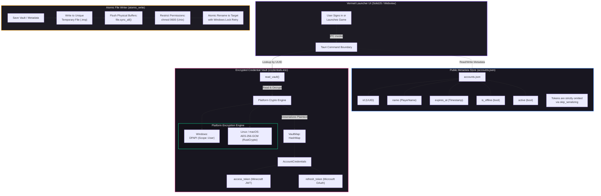

# Secure Credential Vault & Storage Modernization

## Overview & Goal

Vermeil's credential management decouples sensitive authentication secrets (ephemeral Minecraft Services JWTs, durable Microsoft OAuth refresh tokens, and Google Cloud OAuth credentials) from non-sensitive profile and launcher metadata.

Historically, desktop launchers stored credentials in plaintext JSON files (`accounts.json`) or relied on the Windows Credential Manager (`wincred`), which enforces a rigid 512-byte limit (`CRED_MAX_CREDENTIAL_BLOB_SIZE`) that triggers buffer overflow errors when handling Microsoft OAuth SISU tokens exceeding 800+ bytes.

Vermeil addresses these challenges with an isolated, encrypted token vault (`credentials.enc`) providing **operating-system-level cryptographic protection at rest**, **cross-platform AEAD parity**, **zero-downtime automated migration**, and **power-loss / crash-safe atomic disk I/O**.

---

## 1. Architecture & Node Flowchart



---

## 2. Decoupled Storage Separation

| Property | `accounts.json` | `credentials.enc` | `google_cloud.enc` |
| :--- | :--- | :--- | :--- |
| **Purpose** | Profile metadata & display info | Minecraft & Microsoft auth secrets | Google Drive Sync refresh token |
| **Sensitivity** | Public / Non-sensitive | Highly Sensitive (OAuth/JWT) | Highly Sensitive (OAuth) |
| **Format** | Clean Pretty-Printed JSON | Encrypted Ciphertext String (`enc:` / `aead:`) | Encrypted Ciphertext String (`enc:` / `aead:`) |
| **Tokens Present?** | **None** (`skip_serializing`) | Isolated & Encrypted | Isolated & Encrypted |
| **Permissions** | Restrictive (0600 Unix) | Restrictive (0600 Unix) | Restrictive (0600 Unix) |
| **Durability** | `atomic_write` (`.tmp` + `sync_all`) | `atomic_write` (`.tmp` + `sync_all`) | `atomic_write` (`.tmp` + `sync_all`) |

### Public Metadata Model (`accounts.json`)
The `MinecraftProfile` struct designates authentication tokens with `#[serde(default, skip_serializing)]`:
```rust
#[derive(Debug, Clone, Serialize, Deserialize)]
pub struct MinecraftProfile {
    pub id: String,
    pub name: String,
    #[serde(default, skip_serializing)]
    pub access_token: String,
    #[serde(default, skip_serializing)]
    pub refresh_token: Option<String>,
    pub expires_at: i64,
    #[serde(default)]
    pub is_offline: bool,
    #[serde(default, skip_serializing_if = "Option::is_none")]
    pub skin_path: Option<String>,
    #[serde(default = "default_true")]
    pub active: bool,
}
```
When serialized to disk, the `access_token` and `refresh_token` fields are **completely omitted** from the JSON output.

---

## 3. Cryptographic Specification

### Windows (DPAPI)
- Uses Windows Data Protection API (`windows_dpapi`) with `Scope::User`.
- The encryption key is tied directly to the logged-in Windows user session and master key hierarchy derived from the user's password.
- Output string prefix: `enc:<base64>`.
- Bypasses the 512-byte limit of `wincred`, allowing long OAuth refresh tokens to be stored reliably.

### Linux / macOS (Authenticated AES-256-GCM)
- Pure-Rust implementation using RustCrypto's audited `aes-gcm = "0.11"` (`aead = "0.6"`).
- Hardware-accelerated via AES-NI CPU instructions.
- Zero C toolchain, NASM, or CMake compilation dependencies.
- **Key Derivation**: 256-bit SHA-256 digest calculated from `/etc/machine-id` (or `/var/lib/dbus/machine-id`) combined with the current OS user session identity (`$USER` / `$LOGNAME`).
- **Nonces**: High-entropy 96-bit (12-byte) random nonces generated per encryption operation via `rand::rng().fill_bytes()`.
- **Integrity**: 128-bit authentication tag appended to the ciphertext prevents ciphertext tampering or bit-flipping.
- Output string prefix: `aead:<base64(nonce + ciphertext + tag)>`.

---

## 4. Crash & Power-Failure Protection (`atomic_write`)

To protect user credentials against file corruption during sudden system shutdowns, kernel panics, or application terminations, all secret writes utilize an atomic staging algorithm:

1. **Unique Temp File Creation**: Data is written to a unique sibling file (`{filename}.{uuid}.tmp`) in the same directory (ensuring both files reside on the same filesystem partition).
2. **Buffer Flush (`sync_all`)**: Calls `std::fs::File::sync_all()` to force the OS kernel and drive hardware to flush all memory buffers to physical disk before proceeding.
3. **Unix Permission Hardening**: Pre-emptively sets `0o600` permissions on the temp file.
4. **Atomic Rename with Backoff**: Executes `std::fs::rename()`. On POSIX systems, `rename(2)` is atomic. On Windows, file-system filters (such as antivirus scanners) can momentarily hold read locks on newly closed files; `atomic_write` incorporates an exponential backoff retry loop (up to 4 attempts at 25ms intervals) before falling back.

---

## 5. Zero-Downtime Silent Migration

On application startup, `load_accounts()` transparently migrates existing installations without logging users out:

1. `load_accounts()` reads `accounts.json`.
2. If legacy tokens are found inside the file, it decrypts them and stores them in `credentials.enc`.
3. It immediately rewrites `accounts.json` with clean metadata (`access_token` and `refresh_token` omitted).
4. In-memory accounts are populated from the new vault, and subsequent launches load directly from the decoupled vault.
