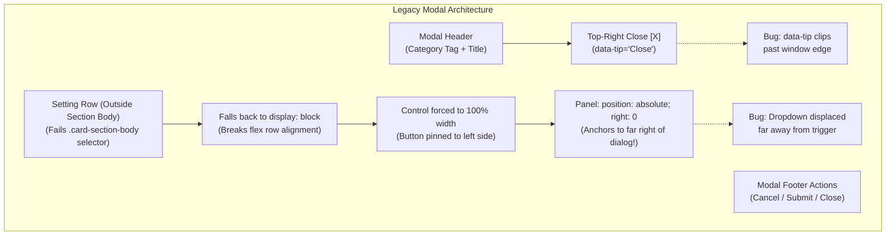
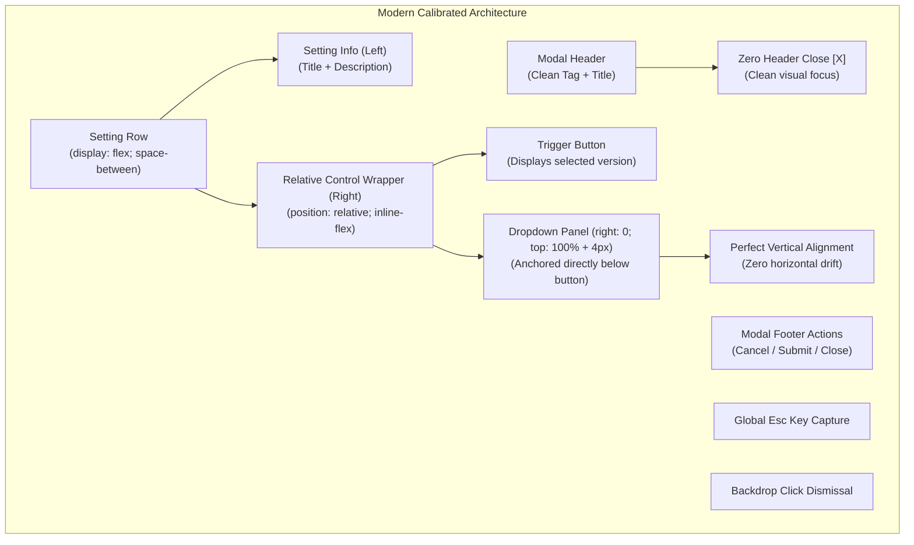
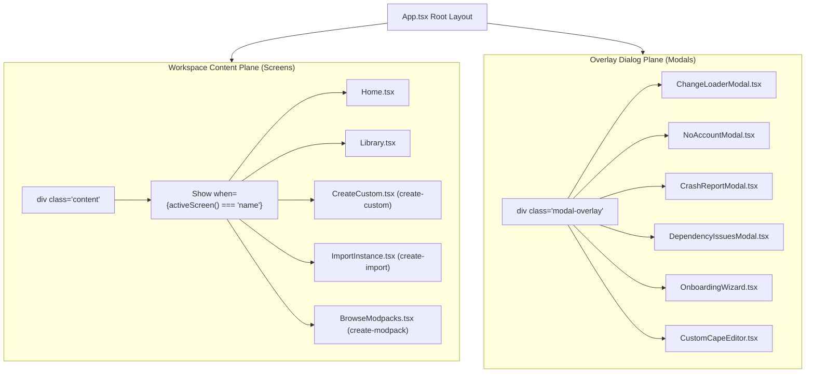

# UI Modal Restraint & Popover Anchoring Architecture

## Abstract

This research document details the architectural overhaul and restraint standards applied to Vermeil's modal dialog system, dropdown popover anchoring, and view hierarchy taxonomy. It addresses two primary UI defects:
1. **Redundant Header Dismiss Affordances**: The clutter of top-right close `[X]` buttons on modal dialogs that already possess explicit footer dismiss controls (`Cancel`, `Close`, `Got it`, `Dismiss`, `Skip setup`), backdrop click handlers, and global `Escape` key capture, which caused visual noise and tooltip viewport clipping.
2. **Displaced Dropdown Popovers**: The floating displacement of select panels caused by `.setting-row` containers falling back to `display: block` outside section bodies, which broke relative coordinate anchoring and threw dropdowns across the modal container.

---

## 1. Architectural Problem & Comparative Flowchart

### Legacy Flawed Pipeline (Redundant Close & Displaced Dropdown)

### Modern Calibrated Pipeline (Single-Point Dismissal & Button Anchoring)

---

## 2. Direct Comparison Table

| Feature / Affordance | Legacy Flawed Implementation | Modern Calibrated Architecture | Impact & Benefit |
| :--- | :--- | :--- | :--- |
| **Top-Right Close `[X]`** | Present on all overlay modals | **Completely Removed** across all 11 modals | Eliminates redundant dismiss cues and prevents `data-tip` viewport edge clipping |
| **Modal Dismissal Point** | Duplicate: Top-right `[X]` + Footer `Cancel`/`Close` | **Single-Point**: Footer `Cancel`/`Close`, Backdrop, `Esc` | Strict adherence to Ponytail restraint principle (*one affordance beats two*) |
| **Setting Plate Layout** | Fallback `display: block` when outside body | Explicit `display: flex; justify-content: space-between` | Prevents block wrapping of controls onto new lines |
| **Dropdown Anchoring** | `right: 0` relative to full modal container | `position: relative` wrapper on trigger button; `right: 0` | Dropdown panel aligns strictly flush beneath the trigger button |
| **View Taxonomy** | Ambiguity between `src/modals/` and screens | Clear delineation: Screens in `content`; Modals in overlay | Prevents treating full-page screens as popups |

---

## 3. Screen vs. Modal Architectural Taxonomy

Vermeil separates view layers into two distinct execution planes:

1. **Full-Page Screens**: Rendered inside `
`. Controlled via `activeScreen()`. They possess full workspace real estate, have back-navigation (`← Back to Setup`), and must not be treated as floating popups.
2. **Overlay Modals**: Rendered on the overlay plane (`.modal-overlay`). Controlled by dedicated signals or events. Always adhere to single-point footer dismissal without redundant top-right `[X]` buttons.
