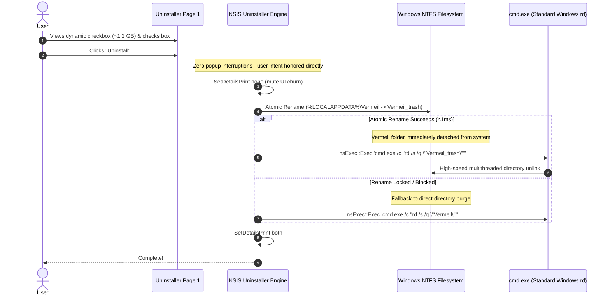
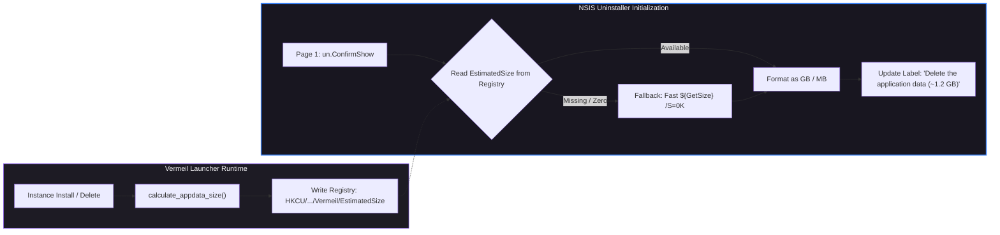

# NSIS Uninstaller Overhaul: High-Speed Bulk Deletion & UX Modernization

## Problem Statement & Context

Minecraft launchers accumulate a unique filesystem footprint:
1. **Asset Objects:** Minecraft's asset index splits textures, sound effects, and models into tens of thousands of tiny, hashed loose files in `assets/objects/` (often 30,000+ files).
2. **Heavy Cache & Instances:** Modpack ZIP extractions, loader libraries, and Java JDK runtimes quickly balloon `%LOCALAPPDATA%\Vermeil` from 1 GB to over 10 GB.

### What Was Wrong With the Previous Uninstaller:
1. **The Crawling Deletion Bottleneck (30–60+ seconds):**  
   NSIS's standard `RMDir /r` is an interpreted instruction that traverses directory trees recursively, attempting to update the installer's graphical listview detail log on every single deleted file. On mechanical hard drives or during active system load (e.g., running high-end games), deleting 30,000+ files causes heavy disk thrashing and visible UI freezes.
2. **Redundant Confirmations:**  
   The initial uninstaller confirm page already presented a checkbox: `[ ] Delete the application data`. If the user purposefully checked this box and clicked **Uninstall**, the uninstaller halted the process with a redundant modal:
   ```
   [MessageBox: "This will permanently delete your Vermeil data folder (approx ... MB)... Are you sure?"]
   ```
   This forced an extra click and broke standard Windows uninstallation ergonomics.
3. **Hidden Footprint:**  
   The user was not shown how much disk space would actually be freed until the secondary popup appeared.

---

## 1. Architectural Solution & Node Diagrams

```mermaid
flowchart TD
    subgraph OldFlow["Previous Uninstaller Flow (Slow & Redundant)"]
        O1["Page 1: Check<br/>'Delete app data'"] --> O2["Click 'Uninstall'"]
        O2 --> O3["Modal Popup:<br/>'Are you sure? (~1.2 GB)'"]
        O3 -->|User clicks Yes| O4["Interpreted RMDir /r<br/>over 30,000+ files"]
        O4 -->|UI redraws on every file| O5["Uninstall freezes<br/>for 30-60s"]
    end

    subgraph NewFlow["Optimized Modern Flow (<2s & Clean UX)"]
        N1["Page 1: Inspect Registry<br/>'EstimatedSize'"] --> N2["Dynamic Checkbox Label:<br/>'Delete app data (~1.2 GB)'"]
        N2 --> N3["User checks box &<br/>clicks 'Uninstall'"]
        N3 --> N4["Atomic Rename:<br/>Vermeil -> Vermeil_trash (<1ms)"]
        N4 --> N5["Native Tree Unlink:<br/>cmd.exe /c rd /s /q"]
        N5 --> N6["Instant Completion<br/>(<2 seconds)"]
    end

    style OldFlow fill:#1d1b24,stroke:#f87171,stroke-width:1px,color:#f4f3f6
    style NewFlow fill:#181620,stroke:#10b981,stroke-width:2px,color:#f4f3f6
```



---

## 2. High-Speed Atomic Detach & Deletion Mechanism

The uninstaller replaces interpreted file-by-file deletion with a **two-phase atomic detachment**:



### Why this is vastly superior:
1. **Instant Detachment (<1 ms):** Renaming a directory on the same NTFS volume only modifies the parent folder's MFT record. Even if the folder contains 50 GB of files, the rename is atomic and instantaneous.
2. **Native Built-In Bulk Deletion:** `cmd.exe /c "rd /s /q"` uses Windows' built-in standard directory removal command, which runs at compiled OS speeds rather than interpreted NSIS script loops.
3. **Zero UI Redraw Overhead:** Running under `SetDetailsPrint none` prevents Windows from repainting the detail log window 30,000 times.

---

## 3. Dynamic Size Calculation & Registry Tracking

To show the accurate data size on Page 1 without causing disk lag during uninstaller launch:



* **Calculation logic in `installer.nsi`:**
  * $\ge 1\text{ GB}$: Formatted as whole and tenths (e.g. `~$1.$2 GB`).
  * $1\text{ MB} - 1023\text{ MB}$: Formatted in megabytes (e.g. `~$1 MB`).
  * $< 1\text{ MB}$: Formatted as `(< 1 MB)`.

---

## 4. Safety & Standards Verification

1. **Path Containment:** Targets exclusively `$LOCALAPPDATA\Vermeil`, `$LOCALAPPDATA\Vermeil_trash`, and legacy pre-v0.6 `$APPDATA\Vermeil`. Never touches any directory outside the application data folder.
2. **Opt-in Preservation:** Default state remains `$DeleteUserData = "0"`. Users who reinstall or update without checking the box have 100% of their instances and worlds preserved.
3. **No Dangling Leftovers:** If a prior uninstallation was killed mid-process, the uninstaller detects any existing `Vermeil_trash` folder on initialization and cleans it up before proceeding.
